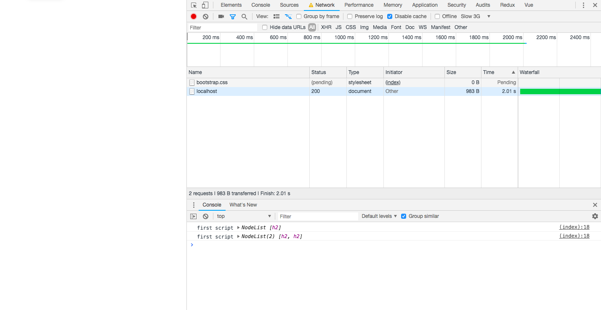
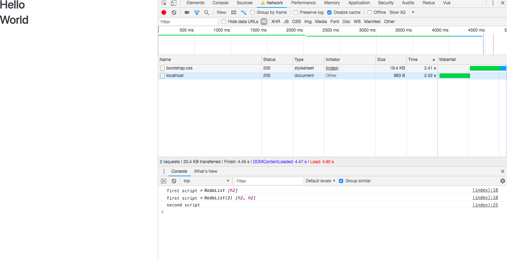
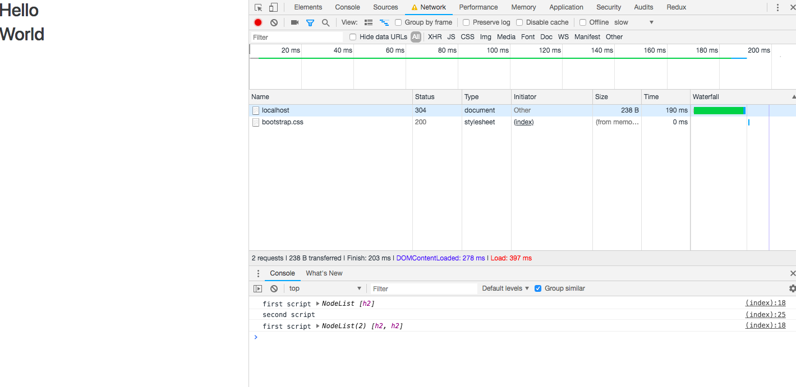
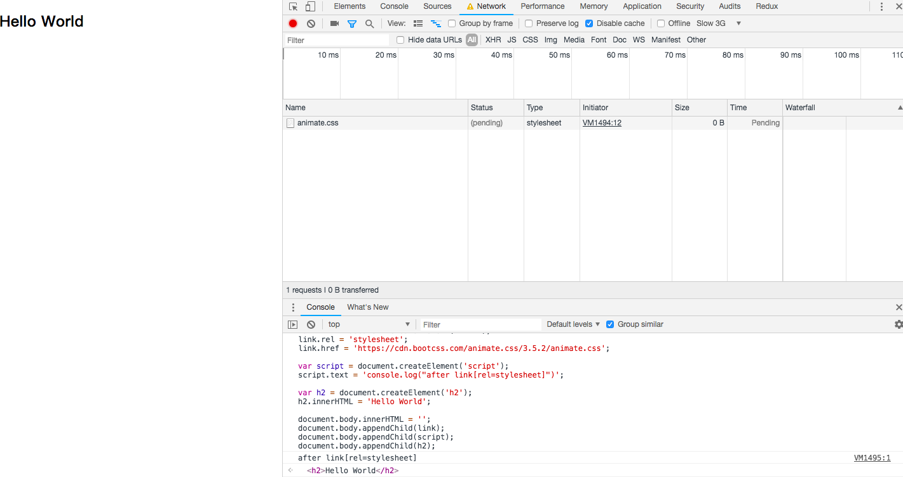
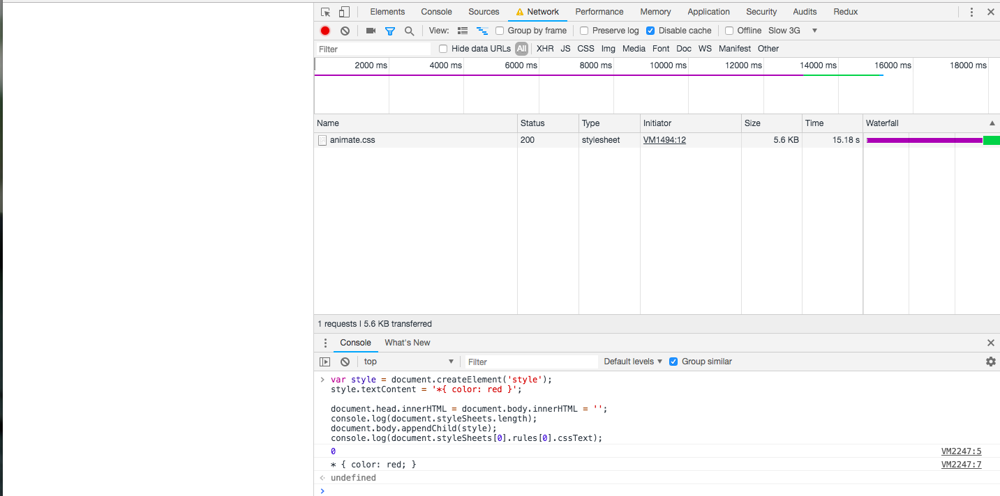
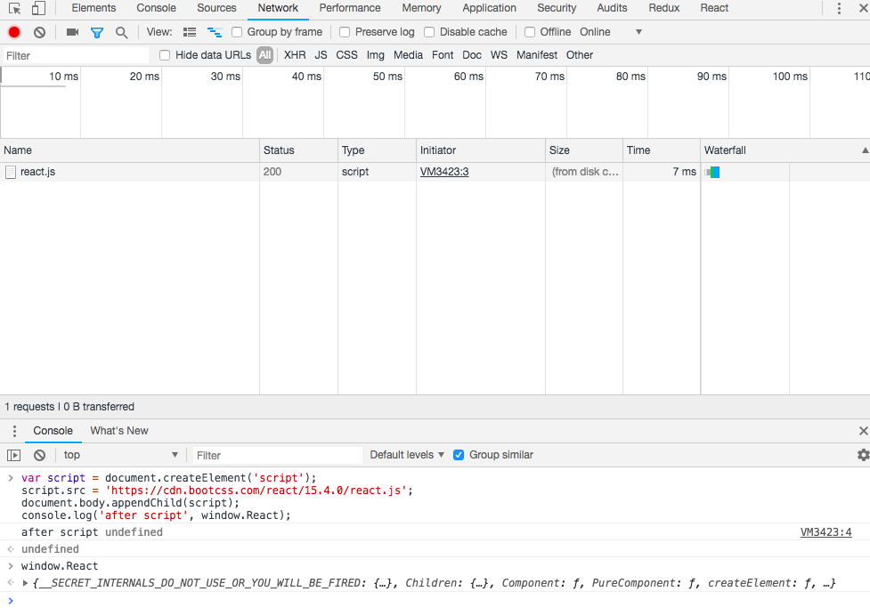
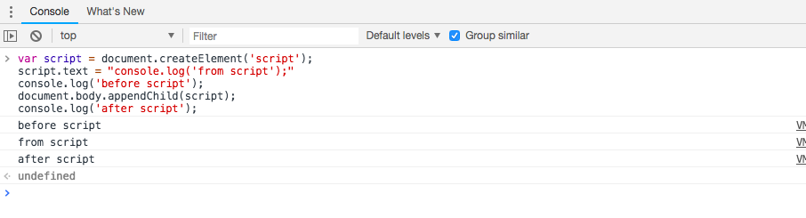

## 同步渲染和异步渲染对 DOM 的阻塞

首先区分一下，什么是同步渲染和异步渲染。

同步：浏览器访问网址，浏览器创建新的tabpage，新的内存块，加载页面的全部资源并渲染全部资源。但只要有页面中的任何一个操作，就会从新的开端全部在创建请求渲染一次，浏览器自己控制的http。

异步：用之前已经渲染过的页面数据，与后台交互数据不需要重新来渲染页面，实现对页面的部分更新。这里主要讲动态插入 HTML 标签的异步渲染。

### 同步渲染

一般我们会把样式写在 HTML 头部，页面脚本放在 `</body>` 之前，因为样式和脚本会阻塞 DOM 渲染，但是样式不阻塞 DOM 解析。

以下是 Webkit 解析资源，最终呈现页面的主流程


#### 脚本和样式表的处理顺序

##### 脚本

解析 HTML 文件过程中，解析器遇到 `<script>`标记时立即解析并执行脚本。文档的解析将停止，直到脚本执行完毕。如果脚本是外部的，那么解析过程会停止，直到从网络同步抓取资源完成后再继续。此模型已经使用了多年，也在 HTML4 和 HTML5 规范中进行了指定。作者也可以将脚本标注为“defer”，这样它就不会停止文档解析，而是等到解析结束才执行。HTML5 增加了一个选项，可将脚本标记为异步，以便由其他线程解析和执行。

##### 预解析

WebKit 和 Firefox 都进行了这项优化。在执行脚本时，其他线程会解析文档的其余部分，找出并加载需要通过网络加载的其他资源。通过这种方式，资源可以在并行连接上加载，从而提高总体速度。请注意，预解析器不会修改 DOM 树，而是将这项工作交由主解析器处理；预解析器只会解析外部资源（例如外部脚本、样式表和图片）的引用。

##### 样式表

另一方面，样式表有着不同的模型。理论上来说，应用样式表不会更改 DOM 树，因此似乎没有必要等待样式表并停止文档解析。但这涉及到一个问题，就是脚本在文档解析阶段会请求样式信息。如果当时还没有加载和解析样式，脚本就会获得错误的回复，这样显然会产生很多问题。这看上去是一个非典型案例，但事实上非常普遍。Firefox 在样式表加载和解析的过程中，会禁止所有脚本。而对于 WebKit 而言，仅当脚本尝试访问的样式属性可能受尚未加载的样式表影响时，它才会禁止该脚本。

------

#### CSS 阻塞 DOM 渲染

这里需要区分 DOM 解析（parsing）和 DOM 渲染 （rendering）。准确来说，是 HTML Parsing 和 DOM Rendering 。无论是外链 CSS 还是内联 CSS ，都会阻塞 Rendering ，也就是说这部分 CSS 在下载并解析结束之前，它后面的 HTML 都不会显示。这也是为什么我们把样式放在HTML内容之前，以防止被呈现内容发生样式跳动。 当然代价就是显示延迟，所以性能攸关的站点都会内联所有CSS。

CSS 阻塞 Rendering 的最直接结果，就是延迟脚本执行和 DOMContentLoaded 事件触发。但是，不同的渲染引擎对此处理不一样，Presto (Opera)就不会延迟脚本的执行。

有些情况下，可以尝试添加媒体查询来避免不必要的阻塞。 尤其是响应式站点可以做此优化：

```cs
<link href="other.css" rel="stylesheet" media="(min-width: 40em)">
```

看一个栗子

```cs
<!DOCTYPE html>
<body>
  <h2>Hello</h2>
  <script> 
    function printH2(){
        console.log('first script', document.querySelectorAll('h2')); 
    }
    printH2();
    setTimeout(printH2);
  </script>
  <link rel="stylesheet" href="http://cdn.bootcss.com/bootstrap/4.0.0-alpha.4/css/bootstrap.css">
  <h2>World</h2>
  <script> console.log('second script'); </script>
</body>
</html>
```

在 Chrome 开发者工具中开启 `Disable Cache` 和 `Throttling` 来模拟较慢的网络。





可以看到 document(HTML) 花了 2.01s 加载，加载完成后，页面还未渲染。

第一次输出只有一个 `<h2>` ，说明脚本执行会阻塞 DOM 解析。

第二次输出有两个 `<h2>` ，说明样式不会阻塞 DOM 解析。

控制台已经打印出 `h2` ，页面还是空白，说明样式会阻塞 DOM 渲染。

2.01s 后，`'second script'` 没有被打印出来，说明样式会阻塞脚本。

但是一般人不会去 `Disable Cache` ，那么如果在允许缓存的情况下，样式表已经缓存过，那句 `setTimeout(printH2);` 还会在样式加载结束后才打印吗？不同渲染引擎对此处理不同，前文有提到，Firefox 在样式表加载和解析的过程中，会禁止所有脚本。而对于 WebKit 而言，仅当脚本尝试访问的样式属性可能受尚未加载的样式表影响时，它才会禁止该脚本。本次实验是在 Chrome 上进行的，反复刷新了几遍后，终于有这样一个结果：



------

#### 脚本阻塞 DOM 解析+渲染

同步渲染模式下，无论是内联的脚本还是外链的脚本，都会阻塞 DOM Parsing ，`DOMContentLoaded` 事件会被延迟，DOM Rendering 自然也被阻塞。由于 JavaScript 只会阻塞后续的 DOM，前面的 DOM 在解析完成后会被立即渲染给用户。 这也是为什么我们把脚本放在页面底部：脚本仍在下载时页面已经可以正常地显示了。

------

### 异步渲染

#### 外链样式表

动态插入的外链样式表不阻塞 DOM Rendering ，当然也不阻塞 DOM Parsing 。

打开一个任何一个页面，在控制台输入以下代码：

```javascript
var link = document.createElement('link');
link.rel = 'stylesheet';
link.href = 'https://cdn.bootcss.com/animate.css/3.5.2/animate.css';

var script = document.createElement('script');
script.text = 'console.log("after link[rel=stylesheet]")';

var h2 = document.createElement('h2');
h2.innerHTML = 'Hello World';

document.body.innerHTML = '';
document.body.appendChild(link);
document.body.appendChild(script);
document.body.appendChild(h2);
```

> 题外话：例子是直接引用参考文章的，文章中外链的 CSS 样式的 Url 里面的协议是 HTTP，在 HTTPS 的网页注入这段代码，外链会被 block 掉。[https 页面中引入 http 资源的解决方式](https://www.jianshu.com/p/c195b4adaec1)

在外链样式表还在下载时，脚本已经执行，文本也已经渲染。



------

#### 内联样式表

与外链样式表不同，内联样式表会阻塞DOM解析（当然渲染也会被阻塞）。 其实不能叫阻塞啦，因为不涉及网络请求，内联样式表的解析本来就是同步的。

我们可以通过 `document.styleSheets` 来检测样式表是否已经解析（Parse）：

```javascript
var style = document.createElement('style');
style.textContent = '*{ color: red }';

document.head.innerHTML = document.body.innerHTML = '';
console.log(document.styleSheets.length);
document.body.appendChild(style);
console.log(document.styleSheets[0].rules[0].cssText);
```



第一处 console.log: `<style>` 尚未插入 DOM 树的时候，样式表的数目为零。

第二处 console.log: 插入 `<style>` 标签后，立刻读取被解析的 CSS 规则。

总结：

 - 未插入 DOM 树的 内联样式不会被解析
 - 插入后样式表会被立即解析，甚至不会进入下一个[事件循环](https://html.spec.whatwg.org/#event-loops)。也就是说，`document.body.appendChild(style);` 执行完之后，进入样式表解析。最后一句 console.log 要一直等待样式解析完成才会执行。如果样式表十分庞大，阻塞将十分明显。

------

#### 外链脚本

动态插入的外部脚本的载入是异步的，不会阻塞解析或者渲染。 这意味着动态插入一个外部脚本后不可立即使用其内容，需要等待加载完毕。 例如

```javascript
var script = document.createElement('script');
script.src = 'https://cdn.bootcss.com/react/15.4.0/react.js';
document.body.appendChild(script);
console.log('after script', window.React);
```



`window.React` 会为空，等到外链资源加载完成后才可用。

#### 内联脚本

内联脚本的表现和内联样式基本一样，阻塞 DOM parsing，阻塞后续脚本。

```javascript
var script = document.createElement('script');
script.text = "console.log('from script');"
console.log('before script');
document.body.appendChild(script);
console.log('after script');
```



#### 资源载入事件

脚本和样式载入事件可以直接监听到，当然这只对非阻塞的资源获取有效。 需要注意的是浏览器兼容性：绝大多数情况监听 `onload` 和 `onerror` 即可， 为了支持IE浏览器，可以监听 `onreadystatechange` 事件。

------

总结：

 - 未插入到 DOM 树的外链样式/脚本，不会发起网络请求，更不会对 DOM Parsing/Rendering 有什么影响。
 - 外链样式表/脚本不阻塞 DOM Parsing 和 DOM Rendering
 - 内联样式表/脚本阻塞 DOM Parsing/Rendering ，阻塞后续脚本（不会进入事件循环）。

------

### 优化

 - 外链样式脚本放在 `<head></head>` 中，因为外链样式不阻塞 DOM 解析，这样做也可以避免样式跳动。
 - 对整个页面样式的调整（会触发回流）如调整 rem 计算策略的 script 脚本，可以放在 `<head></head>` 中，这里可以用内联的方法（虽然不是最佳），阻塞后续 DOM 解析，避免样式跳动。也可以用外链脚本， 加上 `async` 标签可以让脚本的下载不占用 DOM 解析线程，在下载完后立刻执行。
 - 使用 CDN 。不局限于样式和脚本，图片也可以。
 - 样式、图片使用外域，因为浏览器有最大并行下载数限制。解析见[Why do big sites host their images/css on external domains?](https://webmasters.stackexchange.com/questions/26753/why-do-big-sites-host-their-images-css-on-external-domains)
 - `async` `defer` `preload` 。前两个只能作用于脚本


没有标记加载策略的 `script` 和 `async` 都会阻塞 DOM 解析，不同在于 `async` 的下载相对于 DOM 解析是异步的。`defer` 的下载也是异步的，但是下载结束后不立刻执行，而且还会按照 `script` 标签的顺序执行。（这一点 `async` 就不能保证）。
 


> 参考文章
> [CSS/JS 阻塞 DOM 解析和渲染](https://harttle.land/2016/11/26/static-dom-render-blocking.html)
> [异步渲染的下载和阻塞行为](https://harttle.land/2016/11/26/dynamic-dom-render-blocking.html)
> [异步渲染DOM元素的加载时机](http://www.qingpingshan.com/m/view.php?aid=169704)
> [How Browsers Work: Behind the scenes of modern web browsers #The order of processing scripts and style sheets](https://www.html5rocks.com/en/tutorials/internals/howbrowserswork/#The_order_of_processing_scripts_and_style_sheets)
> [有一种优化，叫Preload](https://mp.weixin.qq.com/s/5cnZ9_67-Ikwg4GQ-2nhuw)
> [Tencent CDN](https://cloud.tencent.com/document/product/228/2939#.E5.8A.A0.E9.80.9F.E5.8E.9F.E7.90.86)