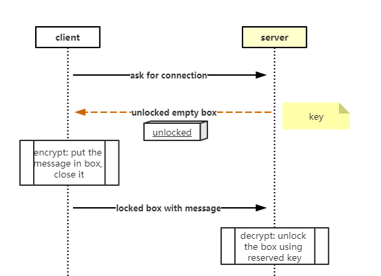

## HTTPS 原理

HTTPS = HTTP + S ，S 是 SSL 或 TLS 。

### SSL & TLS

 - **SSL**：（Secure Socket Layer，安全套接字层），为Netscape所研发，用以保障在Internet上数据传输之安全，利用数据加密(Encryption)技术，可确保数据在网络上之传输过程中不会被截取。当前版本为3.0。它已被广泛地用于Web浏览器与服务器之间的身份认证和加密数据传输。
SSL协议位于TCP/IP协议与各种应用层协议之间，为数据通讯提供安全支持。SSL协议可分为两层： SSL记录协议（SSL Record Protocol）：它建立在可靠的传输协议（如TCP）之上，为高层协议提供数据封装、压缩、加密等基本功能的支持。 SSL握手协议（SSL Handshake Protocol）：它建立在SSL记录协议之上，用于在实际的数据传输开始前，通讯双方进行身份认证、协商加密算法、交换加密密钥等。

 - **TLS**：(Transport Layer Security，传输层安全协议)，用于两个应用程序之间提供保密性和数据完整性。
TLS 1.0是IETF（Internet Engineering Task Force，Internet工程任务组）制定的一种新的协议，它建立在SSL 3.0协议规范之上，是SSL 3.0的后续版本，可以理解为SSL 3.1，它是写入了 RFC 的。该协议由两层组成： TLS 记录协议（TLS Record）和 TLS 握手协议（TLS Handshake）。较低的层为 TLS 记录协议，位于某个可靠的传输协议（例如 TCP）上面。

### 对称加密 & 非对称加密

关于这两种加密方法，Medium 上有一篇文章 [HTTPS explained with carrier pigeons](https://medium.freecodecamp.org/https-explained-with-carrier-pigeons-7029d2193351) 用了通俗的方法，解释得挺清楚的。前端早读课也分享过[翻译版](https://mp.weixin.qq.com/s/GanPiEkJFJqURZ7HNUMXSQ)

简单讲，对称加密（symmetric key cryptography），任一方都知道如何加密，如何解密。但是对称加密的前提是双方已经确认通信。如果要建立通信，不能把加密方法或密钥发送出去（可以被拦截，那加密就没什么意义了），也不能发送“加密”的密钥（对方不知道用什么方法解密）。所以接下来要解决的问题，就是怎么安全地把加密方法或密钥，发送给对方，避免中间人攻击（Man in the Middle Attack）。

非对称加密（ asymmetric key cryptography），一方可以加密信息，但是不能解密别人的已加密信息。比如 client 要向 server 发送一段 message ，大概过程如下：

这就是非对称加密的过程，加密方可以加密 message （lock the box），但是不能解密（open a locked box）。这里的 box 就是公钥（public key），打开 box 的 key 就是私钥（private key）

### 可信任的 box

上面这种方法还有一个问题，client 怎么确定，它接收到的 public key 是 server 发给它的。如果有一个中间人拦截了这个 public key ，替换成一个 evil key，再转发给 client。client 和 server 的对话安全，还是不可保证。

这时候需要一个第三方来告诉 client，刚刚接收到的 public key 是合法的。这就是 Certification Authority 机制。

### RSA

RSA 算法的核心：对一个大数进行因式分解极难。

#### 数学背景

1. 欧拉函数

> 欧拉函数 φ(n) 是小于或等于 n 的正整数中与 n 互质的数的数目。

例如 `φ(8) = 4` ，因为 1,3,5,7 均和 8 互质。

> 如果p，q是质数，N = p * q，那么
> $$φ(N) = φ(p)φ(q) = (p-1)(q-1)$$

简单证明：

1) φ(1) = 1，小于等于 1 且于 1 互质的数只有 1 。

2) 如果 p 是质数，p > 1，φ(p) = p - 1 。比如 5 是质数，那么 φ(5) = 4，因为 1,2,3,4 都与 5 互质。要证明这一点可以用反证法。从定义上，有 φ(p) ≤ p。

1° φ(p) ≠ p，因为 p 与 p 不互质，这样就剩下 p - 1 个数。

2° 假设剩下的 p - 1 中任取一个数 r ，r 与 p 不互质 。也就是存在最大公约数 s ，s ≠ 1 ，使得 ms = r, ns = p。

3° ns = p 与 p 是质数这一前提矛盾，假设不成立。

3) 若m,n互质，则 φ(mn) = φ(m)φ(n) 【证明未给出】

4) 如果n是a的k次幂，则 φ(n) = φ(a^k) = a^k - a^(k-1) = (a-1)a^(k-1) 【证明未给出】

2. 模反元素

> 如果两个正整数a和n互质，那么一定可以找到整数b，使得 ab-1 被n整除，或者说ab被n除的余数是1。
> $$a * b = 1 mod(n)$$

3. 欧拉定理

> 如果两个正整数a和n互质，则n的欧拉函数 φ(n) 可以让下面的等式成立：
> $$a^φ(n) = 1(mod n)$$

由此可得：a 的 φ(n - 1) 次方肯定是a关于n的模反元素。

欧拉定理就可以用来证明模反元素必然存在。

由模反元素的定义和欧拉定理我们知道，a 的 φ(n) 次方减去 1 ，可以被 n 整除。比如，3 和 5 互质，而 5 的欧拉函数 φ(5) 等于 4 ，所以 3 的 4 次方(81)减去 1 ，可以被 5 整除（80/5=16）。

小费马定理：

> 假设正整数a与质数p互质，因为质数 p 的 φ(p) 等于 p - 1，则欧拉定理可以写成
> a^(p-1) = 1 mod(p)
> 这其实是欧拉定理的一个特例。

#### 公钥密钥生成

1. 寻找两个不相等的大质数

质数p，q，满足：

$$p ≠ q$$
$$N = p * q$$

2. 根据欧拉函数获取 r

$$r = φ(N) = φ(p)φ(q) = (p-1)(q-1)$$

3. 选择一个小于 r 并与 r 互质的数 e，求得 e 关于 r 的模反元素，记为 d

$$e * d = 1 mod(r)$$

e 通常取 65537 。

4. 销毁 p 和 q

公钥：(N, e)
私钥：(N, d)

N 和 e 会公开使用，所以“根据 N 和 e 破解出 d”的难度，决定了 RSA 的加密强度。

想解出 d ，d 是 e 关于 r 的模反元素，所以要解出 r 。

r = φ(N) = φ(p)φ(q) = (p-1)(q-1) ，所以需要解出 p ，q 。

N = p * q，从公开的数据中我们只知道 N 和 e ，所以问题的关键就是对 N 做因式分解能不能得出 p 和 q 。

### HTTPS 完整过程

非对称加密用来加密后续对称加密需要使用的密钥。

> 参考
> 
> [SSL/TLS原理详解](https://segmentfault.com/a/1190000002554673#articleHeader0)
> 
> [RSA 算法详解](https://juejin.im/post/5a76d7e3f265da4e752770a3)
> 
> [https连接的前几毫秒发生了什么](https://fed.renren.com/2017/02/03/https/)