## HTTPS 原理

HTTPS = HTTP + S ，S 是 SSL 或 TLS 。

### SSL & TLS


 - **SSL**：（Secure Socket Layer，安全套接字层），为Netscape所研发，用以保障在Internet上数据传输之安全，利用数据加密(Encryption)技术，可确保数据在网络上之传输过程中不会被截取。当前版本为3.0。它已被广泛地用于Web浏览器与服务器之间的身份认证和加密数据传输。
SSL协议位于TCP/IP协议与各种应用层协议之间，为数据通讯提供安全支持。SSL协议可分为两层： SSL记录协议（SSL Record Protocol）：它建立在可靠的传输协议（如TCP）之上，为高层协议提供数据封装、压缩、加密等基本功能的支持。 SSL握手协议（SSL Handshake Protocol）：它建立在SSL记录协议之上，用于在实际的数据传输开始前，通讯双方进行身份认证、协商加密算法、交换加密密钥等。

 - **TLS**：(Transport Layer Security，传输层安全协议)，用于两个应用程序之间提供保密性和数据完整性。
TLS 1.0是IETF（Internet Engineering Task Force，Internet工程任务组）制定的一种新的协议，它建立在SSL 3.0协议规范之上，是SSL 3.0的后续版本，可以理解为SSL 3.1，它是写入了 RFC 的。该协议由两层组成： TLS 记录协议（TLS Record）和 TLS 握手协议（TLS Handshake）。较低的层为 TLS 记录协议，位于某个可靠的传输协议（例如 TCP）上面。

### 对称加密 & 非对称加密

关于这两种加密方法，Medium 上有一篇文章 [HTTPS explained with carrier pigeons](https://medium.freecodecamp.org/https-explained-with-carrier-pigeons-7029d2193351) 用了通俗的方法，解释得挺清楚的。前端早读课也分享过[翻译版](https://mp.weixin.qq.com/s/GanPiEkJFJqURZ7HNUMXSQ)

简单讲，对称加密（symmetric key cryptography），任一方都知道如何加密，如何解密。但是对称加密的前提是双方已经确认通信。如果要建立通信，不能把加密方法或密钥发送出去（可以被拦截，那加密就没什么意义了），也不能发送“加密”的密钥（对方不知道用什么方法解密）。所以接下来要解决的问题，就是怎么安全地把加密方法或密钥，发送给对方，避免中间人攻击（Man in the Middle Attack）。

非对称加密（ asymmetric key cryptography），一方可以加密信息，但是不能解密别人的已加密信息。比如 client 要向 server 发送一段 message ，大概过程如下：


这就是非对称加密的过程，加密方可以加密 message （lock the box），但是不能解密（open a locked box）。这里的 box 就是公钥（public key），打开 box 的 key 就是私钥（private key）


### 可信任的 box

上面这种方法还有一个问题，client 怎么确定，它接收到的 public key 是 server 发给它的。如果有一个中间人拦截了这个 public key ，替换成一个 evil key，再转发给 client。client 和 server 的对话安全，还是不可保证。

这时候需要一个第三方来告诉 client，刚刚接收到的 public key 是合法的。这就是 Certification Authority 机制。


### RSA

RSA 算法的核心：对一个大数进行因式分解极难。

#### 数学背景

1. 欧拉函数

> 欧拉函数 φ(n) 是小于或等于 n 的正整数中与 n 互质的数的数目。

例如 `φ(8) = 4` ，因为 1,3,5,7 均和 8 互质。

> 如果p，q是质数，N = p * q，那么
> $$φ(N) = φ(p)φ(q) = (p-1)(q-1)$$

简单证明：

1) φ(1) = 1，小于等于 1 且于 1 互质的数只有 1 。

2) 如果 p 是质数，p > 1，φ(p) = p - 1 。比如 5 是质数，那么 φ(5) = 4，因为 1,2,3,4 都与 5 互质。要证明这一点可以用反证法。从定义上，有 φ(p) ≤ p。

1° φ(p) ≠ p，因为 p 与 p 不互质，这样就剩下 p - 1 个数。

2° 假设剩下的 p - 1 中任取一个数 r ，r 与 p 不互质 。也就是存在最大公约数 s ，s ≠ 1 ，使得 ms = r, ns = p。

3° ns = p 与 p 是质数这一前提矛盾，假设不成立。

3) 若m,n互质，则 φ(mn) = φ(m)φ(n) 【证明未给出】

4) 如果n是a的k次幂，则 φ(n) = φ(a^k) = a^k - a^(k-1) = (a-1)a^(k-1) 【证明未给出】


2. 模反元素

> 如果两个正整数a和n互质，那么一定可以找到整数b，使得 ab-1 被n整除，或者说ab被n除的余数是1。
> $$a * b = 1 mod(n)$$


3. 欧拉定理

> 如果两个正整数a和n互质，则n的欧拉函数 φ(n) 可以让下面的等式成立：
> $$a^φ(n) = 1(mod n)$$

由此可得：a 的 φ(n - 1) 次方肯定是a关于n的模反元素。

欧拉定理就可以用来证明模反元素必然存在。

由模反元素的定义和欧拉定理我们知道，a 的 φ(n) 次方减去 1 ，可以被 n 整除。比如，3 和 5 互质，而 5 的欧拉函数 φ(5) 等于 4 ，所以 3 的 4 次方(81)减去 1 ，可以被 5 整除（80/5=16）。

小费马定理：

> 假设正整数a与质数p互质，因为质数 p 的 φ(p) 等于 p - 1，则欧拉定理可以写成
> a^(p-1) = 1 mod(p)
> 这其实是欧拉定理的一个特例。

#### 公钥密钥生成

1. 寻找两个不相等的大质数

质数p，q，满足：

$$p ≠ q$$
$$N = p * q$$

2. 根据欧拉函数获取 r

$$r = φ(N) = φ(p)φ(q) = (p-1)(q-1)$$

3. 选择一个小于 r 并与 r 互质的数 e，求得 e 关于 r 的模反元素，记为 d

$$e * d = 1 mod(r)$$

e 通常取 65537 。

4. 销毁 p 和 q

公钥：(N, e)
私钥：(N, d)

N 和 e 会公开使用，所以“根据 N 和 e 破解出 d”的难度，决定了 RSA 的加密强度。

想解出 d ，d 是 e 关于 r 的模反元素，所以要解出 r 。

r = φ(N) = φ(p)φ(q) = (p-1)(q-1) ，所以需要解出 p ，q 。

N = p * q，从公开的数据中我们只知道 N 和 e ，所以问题的关键就是对 N 做因式分解能不能得出 p 和 q 。

### HTTPS 完整过程

tcp 抓包结果如下：

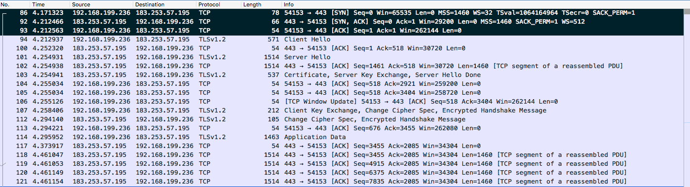

#### 建立 tcp 链接

前三段 tcp 报文，并且很明显有：

```
C ---- [SYN]       Seq=0       ---> S
C <--- [SYN] [ACK] Seq=0 Ack=1 ---- S
C ----       [ACK] Seq=1 Ack=1 ---> S
```

这就是 tcp 三次握手。

#### Client Hello

 - TLS 版本

使用的TLS版本是1.2，TLS有三个版本，1.0，1.1，1.2，1.2是最新的版本，https的加密就是靠的TLS安全传输层协议

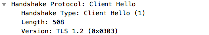

 - 客户端当前的时间和一个随机密码串，这个时间是距Unix元年(1970.1.1)的秒数

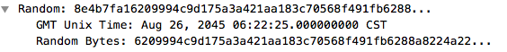

 - sessionId，会话ID，第一次连接时为0，如果有sessionId，则可以恢复会话，而不用重复握手过程

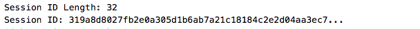

 - 浏览器支持的加密组合方式：可以看到，浏览器一共支持 17 种加密组合方式，发给服务器，让服务器选一个。

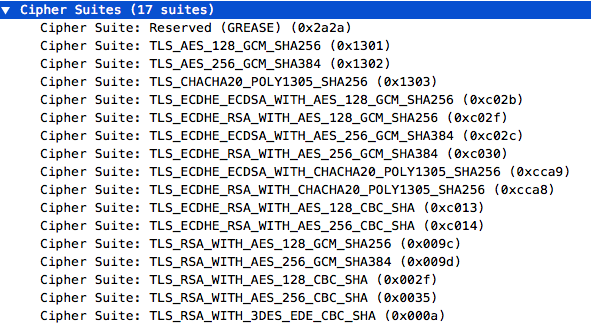

 - server 域名

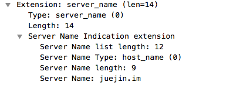

域名是工作在应用层 http 里的，而握手是发生在 TLS ,还在传输层。在传输层里面就把域名信息告诉服务器，好让服务根据域名发送相应的证书。

#### Server Hello

服务器收到了Client Hello的信息后，就给浏览器发送了一个Server Hello的包，这个包里面有着跟Client Hello类似的消息

 - 时间、随机数等，注意服务器还发送了一个Session Id给浏览器

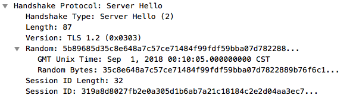

 - 服务器选中的加密方式

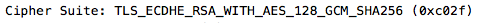

 - Certificate 证书

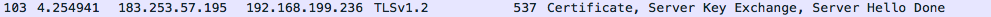

可以看到 server 发送了两份证书

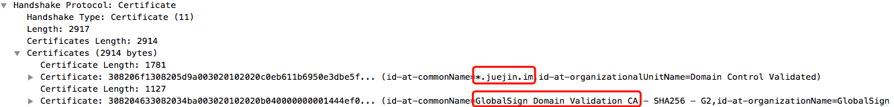

在浏览器中可以查看这些证书的关系。

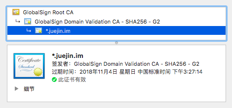

GlobalSign Root CA 是系统根证书，现代网络操作系统都会内置一份可信的根证书列表（Firefox 的根证书列表独立于操作系统之外）。
所谓“可信的根证书列表”是指操作系统开发商通过严格地审核，将安全可靠、可被信任的 CA 机构纳入白名单，并将这些权威可信 CA 的根证书预安装到操作系统中。

浏览器中可以查看根证书

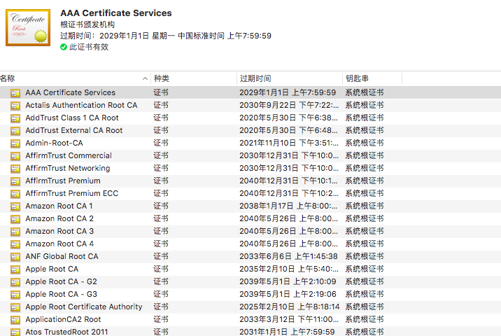

`*.juejin.im` 的证书是依赖于 `GlobalSign Domain` 的证书，换句话说，`GlobalSign Domain` 的证书为 `*.juejin.im` 的证书做担保，而根证书 `GlobalSign Root` 为 `GlobalSign Domain` 做担保，形成一条依赖链。明白这点很重要，从技术的角度上来说，`GlobalSign` 为 `*.juejin.im` 的证书做签名，只要签名验证正确就说明 `*.juejin.im` 的证书是合法的。

`*.juejin.im` 证书里面会指明它的上一级证书

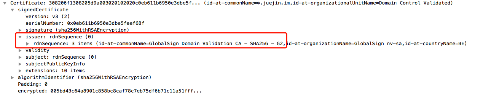

现在来看下一个证书里面具体有什么内容。

除了上面提到的签名外，每个证书还包含签名的算法，和被签名的证书 tbsCertificate(to be signed Certificate)三部分：

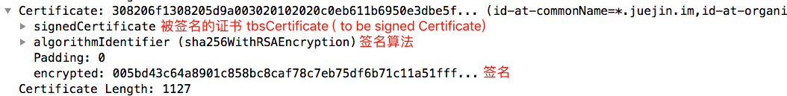

tbsCertificate 展开可以看到证书所支持的域名、有效期

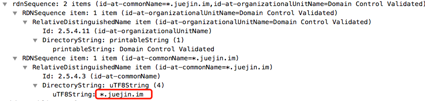

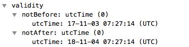

还有证书的公钥

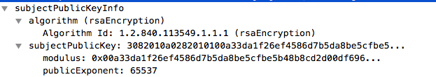

把公钥拷贝出来，是一个 270 字节的数字。

```java
String publicKey = "3082010a0282010100a33da1f26ef4586d7b5da8be5cfbe5b48b8cd2d00df6960b640fab2d959a2cac1ae4022756c1f70d2701de0b133039c29793cf0c21382e18f1d6720f1d57c0261ee07a0afeb508e83896e1ce3e98d9ccc636e2b1627be11b258b6e5c1cc8c4721dbf2c6672cc8e2c23da576b6ecbf3f93227e756a7b195f00e329d043e1ba84af1a259e69c06a80a050d1b5649e6e52a93c4d418f43361282883591ae90019ea933054799c330d046fde030260dc815bee0b292b5c2317b6eff77e2d37512101c0bde04b898aee85fb7ce73f93728ac8c506f785927073c2b18d7d479664bb95f2db970e984afdd0df70f6f7d1da3953672e804a1fd0354ddbf6063912dba9950203010001";
```

黑色部分是标志位，公钥可以拆为 N 和 e 两部分。

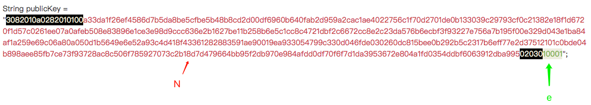

N 是一个十六进制的 512 位数字，换算成二进制有 2048 位。普通的证书是1024位，2048位是一个很高安全级别，换算成10进制是617位，如果你能够将这个617位的大整数拆成两个质数相乘，就可以推导出密钥（但这是不可能的）。

e 为 65537 ，证书通常取的幂指数都为这个数字。

证书里面可以知道证书的加密算法为RSA + SHA256，SHA是一种哈希算法，可用来检验证书是否被篡改过：

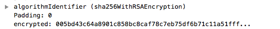

将 encrypted 的值拷贝出来，就是证书的签名

```java
String signature = "005bd43c64a8901c858bc8caf78c7eb75df6b71c11a51fff9afa1f1c8c1b7c4e12f70f1c02abaed13db0d791c105f620bf7b5d62f4cc29626acc941ba7088acad006c076be34afceb600107d3ebd997304d4d652143aba3161e5de12658bc3bec017cea58dec7993e678ef018f5d4709c5090db811f29da51baf28db97f04d6df2ef9893682128b0d3c74bf1c3531f474251cfcbb4a7c3832bec9c4e9719d58153f6547238f188c6f59af020b79d55a8722bdb64c5a0453be72a264d199fa6b35af72c88ff5cff7529f53d785afb1d343e782960af396f89201452c2725992d231e2277029eb12bcaaf4ccfd625fb0e2026bfc3946581690bb56ca6ca7864981";
```

这个签名是一个 256 个字节的数字，它是 GlobalSign Domain 用它的密钥对 tbsCertificate 做的签名，可以用 GlobalSign Domain 的公钥进行解密。

解出来的结果可以提取一段 SHA 哈希，记为 sha1，

对 tbsCertificate 做 SHA 哈希，得到 sha2，

只有 sha1 == sha2 ，我们认为证书没有被篡改。

中间人有没有可能既篡改了证书，还能保证哈希值是对的？首先不同的字符串被SHA256哈希后的值是一样的概率比较小，同时由于密钥和公钥是一一配对的，所以中间人只能把公钥改成它的公钥，这个公钥是一个p * q 的整数，所以他必须得满足两个条件，一个是要更改成一个有意义的公钥，另一个是整个证书的内容被哈希后的值和没改前是一样的，满足这两个条件就相当困难了。

#### Server Key Exchange 和 Client Key Exchange

看抓包结果，Server Key Exchange 和 Certificate 是在同一段报文里面的。

客户端确认证书合法之后，接收 server 的公钥，并把自己的公钥发送给 server 。

这次交换的公钥，要比证书的公钥短很多，只有 97 字节。同时加密的算法也不是 RSA （RSA的计算量太大）所以RSA是用来验证身份然后交换密钥的，并不是用来加密数据的，因为它计算量太大。加密数据是用的ECDHE生成的密钥和公钥。

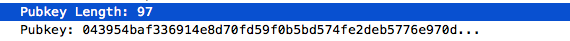

同样地，浏览器结合服务器发给它的随机密码(Server Hello)，生成它自己的主密钥，然后发送公钥发给服务器

双方交换密钥之后，浏览器给服务器发了一个明文的 Change Cipher Spec 的包，告诉服务器我已经准备好了，可以开始传输数据了,同样地，服务器也会给浏览器发一个Change Cipher Spec的包：

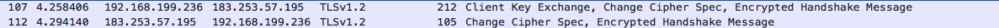

实际上，这些包并不是一个个单独发的，client 发送 Client Key Exchange 的时候，连带把 Change Cipher Spec 的包和 Encrypted Handshake Message 的请求一并发送出去，server 的响应也是类似的。这样可以节约几次 RTT 时间。

浏览器给服务回了个ACK，然后就开始传输数据：

数据传输过程，是对称加密的，那为什么还要交换公钥？公钥的作用是加密“对称加密的钥匙”。

服务器选择的数据传输加密方式为AES，AES是一种高效的加密方式，它会使用主密钥（服务器的私钥）生成另外一把密钥。


> 参考
> 
> [SSL/TLS原理详解](https://segmentfault.com/a/1190000002554673#articleHeader0)
> 
> [RSA 算法详解](https://juejin.im/post/5a76d7e3f265da4e752770a3)
> 
> [https连接的前几毫秒发生了什么](https://fed.renren.com/2017/02/03/https/)