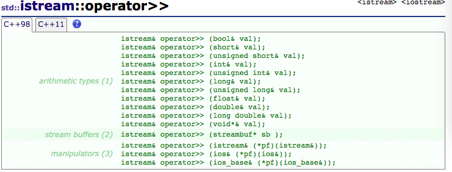

# c++ 常用输入

程序的输入都建有一个缓冲区，即输入缓冲区。每次输入过程是这样的，当一次键盘输入结束时会将输入的数据存入输入缓冲区，而 cin 函数直接从输入缓冲区中取数据。正因为 cin 函数是直接从缓冲区取数据的，所以有时候当缓冲区中有残留数据时，cin 函数会直接取得这些残留数据而不会请求键盘输入。

如果 cin 请求键盘输入，输入回车时候，判断输入结束。

## 来自 iostream 库的 cin

### cin >>

根据 cin>>sth 中 sth 的变量类型读取数据，这里变量类型可以为 int，float ,char ,char* ,string等诸多类型。这一输入操作，在遇到结束符（Space、Tab、Enter）就结束，且对于结束符，并不保存到sth中。

cin >> 读取数据时，遇到空格则结束。cin 不会读取任何长度的空格。所以通过输入一次性给变量 a ，b 赋值，可以 `cin >> a >> b;`。但是**space，tab，enter会留在缓冲区，可能对下一次输入（比如用 cin.get() 读取字符串）有影响**。

注意 cin 在输入 char 数组和 string 时候的不同。string 的长度不限定。字符串末尾不会添加 `'\0'`。对于 char 数组，字符串末尾会有 `'\0'`。至于 `'\0'` 后面的内存存了什么东西，就不可控制了。如果输入长度已经足够把 char 数组填满，程序还是会按序把输入填入这段内存，并且添加 `'\0'` 。如果我们把 char 数组的长度认为是初始化给出的长度，那么很容易丢失那些“在长度以外”的字符。

对用户手动输入 char 的数组遍历的时候（我们认为末尾有 `'\0'` ），可以用指针，或者 `'\0'` 判断是否到数组尾。


### cin.get()

**cin.get(字符数组名，接受长度，结束符)**。其中结束符意味着遇到该符号结束字符串读取,默认为ENTER，读取的字符个数最多为（长度-1），因为最后一个为 `'\n'` 。要注意的是，cin.get()读取数组时遇到结束符停止读取，但并不会将结束符从缓冲区丢弃。cin.get()有如下几种用法：

(1) cin.get() 接受一个字符（char）

这两种书写方式等价：

```cpp
char ch;
ch = cin.get();
cin.get(ch);
```

cin.get() 从缓冲区读取一个字符，会读取space，tab，enter。

(2) 接收一定长度的字符串cin.get(字符数组名，接收长度，结束符)

结束符为可选参数，默认为Enter，可以接受Space 、Tab，对于结束符的处理要注意，结束符并不会丢掉。默认的结束符是 enter ，即 `'\n'` 。

```cpp
char ch1[10], ch2[5];
cin.get(ch1,5);
cin.get(ch2,5);
```


第一次输入：`hello cpp~` ，回车。此时 ch1 ch2 如下：

```
ch1: |'h'|'e'|'l'|'l'|'\0'|
ch2: |'o'|' '|'c'|'p'|'\0'|
```

cin.get() 接收空格，而且会在字符串末尾加上 `'\0'` ，实际接受字符个数 = 接受长度 - 1。

第二次输入 `hi~` ，回车。结果就是 ch1 存入了所有非结束符字符，把 `'\n'` 留在缓冲区头部，ch2 没办法从缓冲区读取输入。

解决方法就是用 cin.get(char) 读取掉缓冲区的回车。前提是第一行输入的字符个数小于五，才能保证 ch1 读取缓冲区字符后，回车在缓冲区头部。

```cpp
char dummy;
cin.get(ch1,5);
cin.get(dummy);
cin.get(ch2,5);

// 这两种方法等价
cin.get(ch1,5).get();
cin.get(ch2,5);
```

### cin.getline()

cin.getline(字符数组名，接收长度，结束符)。其用法与cin.get(字符数组名，接收长度，结束符)极为类似。cin.get()当输入的字符串超长时，不会引起cin函数的错误，后面若有cin操作，会继续执行，只是直接从缓冲区中取数据。但是cin.getline()当输入超长时，会引起cin函数的错误，后面的cin操作将不再执行。

cin.getline() 也接受空格，对 char 数组，末尾加 `'\0'` 。

> cin.get() cin.getline()在处理“字符串”，指的是 char 数组。它们都不会把回车读进字符串，cin.get() 不会丢弃回车，回车会存留在缓冲区；cin.getline() 则会丢弃回车。

## 来自 string 库的方法

这里处理的“字符串”，指的是 string 对象。

### getline(istream is,string str,结束符)

同样，此处结束符为可选参数（默认依然为Enter）。然而，getline() 与前面的诸多存在的差别在于，它string库函数下，而非前面的istream流，所有调用前要在前面加入#include。与之对应这一方法读入时第二个参数为string类型，而不再是char* ，要注意区别。另外，该方法也不是遇到空格就结束输入的。

```cpp
string s1;
getline(cin, s1);      // 空格不敏感，enter 为结束符，结束符会被丢弃，不保存在缓冲区
getline(cin, s1, '0'); // 空格不敏感，字符 '0' 为结束符，结束符会被丢弃，不保存在缓冲区
```

注意“结束符被丢弃”的意思，是从缓冲区读取**一个**结束符，丢弃它。如果连续输入两个以上的结束符，第一个之后的那些不会被丢弃。下次再从缓存区读取时，如果定义的结束符没变，那什么也读取不到。

当定义了结束符，getline 对回车都不敏感。如下例子，输入 `abcd\ne  00` 。

```cpp
string s1;
getline(cin, s1, '0'); // 'abcd\ne  ' 此时缓冲区有一个 '0'
```


## while(cin >> a)

有时候我们会看到像 `cin >> a >> b;` 的操作。cin 有返回值吗？其实这句话不对。cin 本身是一个流对象，不存在“返回值”这一说法。真正在搞怪的是 `>>` 操作符。

`>>` 操作符重载了多个版本，以适应不同类型的输入。



其实不止 `>>` 操作符，`cin.get()` `cin.getline` `getline()` 的返回值都是 `istream&` 即流对象的引用。所以我们可以“链式调用” cin。

## 流错误处理

在对一个流对象进行I/O操作时，可能会产生错误。当错误发生时，错误的性质被记录在ios类的一个数据成员中。

ios类中定义的描述错误状态的常量:

   goodbit-------------没有错误，正常状态　

   eofbit--------------到达流的结尾 

   failbit-------------I/O操作失败，清除状态字后，可以对流继续进行操作。

   badbit--------------试图进行非法操作，清除状态字后，流可能还可以使用。 

   hardfail------------致命错误，不可恢复的错误。


对应于这些位,可用ios中定义的如下函数来检查流的当前状态位:

   int good()---------如果正常,返回非0值

   int bad()----------如果badbit被设置,返回非0值

   int eof()----------如果eofbit被设置,返回非0值

   int fail()---------如果failbit被设置,返回非0值

   int rdstate()------返回当前错误状态位

if可直接判断流，如if (cin)

while间接判断，如while (cin >> x)

若流被标记错误（读取失败）就返回false.

ctrl+z,F6可跳出循环，这代表eof（文件结束符）

例子：

```cpp
int a;
while(cin >> a) { // 当输入不是 int，（比如输入字符，就会结束循环）
	//...
}
```


