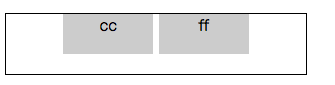

> [css width, height, margin 的计算](./css-basic.md)

### 居中

子元素可能是块级元素，行内不可替换元素，行内可替换元素（以 img 元素为例）。

后面的样式基于下面的 html：

```html
<div class="parent">
  <div class="child"></div>
</div>
```

#### margin-left + margin-right

一般来说，我们会给块级元素设定 width （width 为 auto 的话会被计算为撑满包含块，那就无所谓“居中”了）。最常用水平居中就是 `margin: 0 auto` 。

```css
.child {
	margin: 0 auto;
	width: 20px; /* width: 40%; */
}
```

子元素定位是 relative 或 static 的情况下，会把第一个块级元素作为自己的包含块。处于文档流的子元素的左右 margin 会被计算为相等数值，这是居中的依据。

这种居中方法可以居中块级元素。对于 img 稍做处理：在外部包裹上一层 div ，让 img 的 width 等于这层 div 的 100% 。img 加上包裹的 div ，就是一个块，适用本条居中原则。

类似的，height 属性可以这么做吗？然而 `margin: auto 0` 并不会垂直居中任何东西，因为 height 属性的计算法则里面，文档流中的元素，auto 值的上下 margin 会被计算为 0 。 

#### absolute + margin-left/transform

子元素是绝对定位的条件下，需要打破原先的包含块 position 的 static 定位（一般用 relative ）。

```css
.parent {
	position: relative;
}

.child {
	position: absolute;
	left: 50%;
	margin-left: -30px;
	width: 60px;
}
```

子元素定宽（显示指定 px、em、rem 值）的条件下，可以用上 margin-left 负值。子元素不定宽的时候用 `transform: translateX(-50%)` 可以解决问题。

绝对定位的原理也可以应用到垂直居中上。

#### inline-block + text-align

inline-block：对外呈现行内元素，对内呈现块级元素。所以可以设定宽高；没有指定宽高的时候，像行内元素一样由内容去界定盒子大小。可以像行内元素一样，多个排列在一行。

```css
.parent {
	text-align: center;
}

.child {
	display: inline-block;
}
```

多个 inline-block 元素并排，元素之间在某些情况下会出现“莫名的间隙”。



```html
<!-- 不会有间隙 -->
<div class="parent">
	<div class="child box">cc</div><div class="child box">ff</div>
</div>

<!-- 出现间隙 -->
<div class="parent">
	<div class="child box">cc</div>
	<div class="child box">ff</div>
</div>
```

间隙是子元素之间的空格符或回车符引起的。既然是字符，那便可以让它“最小化”，达到去除间隙的目的。

```css
.parent {
	font-size: 0;
}

.child {
	font-size: 14px;
}
```

#### 单行文字、图片、块框垂直居中

居中单行文字，只需给文字所在的元素加上 line-height 属性，值等于元素 height 。

单行图片也是类似的，我们把图片看成文字。

```html
<div class="parent">
    
</div>
```

```css
.parent {
	height: 60px;
	line-height: 60px;
}
.child {
	vertical-align: middle;
}
```

vertical-align 属性只对 table-cell 以及 inline-element 起作用。如果垂直居中一个块框，把它的 display 属性设为 inline-block，然后处理方法如图片垂直居中。

#### flex 布局

指定包含框为一个 flex 容器，定义项目在主轴和次轴的对齐方式。

```css
.parent {
  display: flex;
  justify-content: center;
  align-items: center;
}
```

### 经典布局方案

#### 圣杯布局

布局的思路参考 Matthew Levine 于2006年在「A LIST APART」上写的文章 [In Search of the Holy Grail
](https://alistapart.com/article/holygrail) 。侧边栏定宽，中间自适应布局，用 padding 空出容器两边的侧边栏，通过浮动定位放置三栏。

```html
<div id="header">#header</div>
  <div class="container">
    <div class="middle"></div>
    <div class="left column"></div>
    <div class="right column"></div>
  </div>
  <div id="footer">#footer</div>
```


[codepen demo](https://codepen.io/sheepig-the-bashful/full/MPWPwP)

主要的技巧是 `margin-left: -100%` 会导致浮动块上移一行，盖住前一块。margin-left 负的值等于浮动块 width 时，上移一行，紧贴前一个块的末尾。

#### 双飞翼布局

当页面缩放，中间块的 content 宽度小于任一侧边栏的时候，会发生布局混乱。


因为 padding 不会被计算到包含块里面，三栏都是浮动的，就会造成“挤不下”的局面。

[codepen demo](https://codepen.io/sheepig-the-bashful/full/YJPqVW)

```html
<div id="header">#header</div>
  <div class="container">
    <div class="middle-wrap column"><div class="middle"></div></div>
    <div class="left column"></div>
    <div class="right column"></div>
  </div>
  <div id="footer">#footer</div>
```

container 不需要设置 padding ，直接让它撑满视口。我们在中间那一栏加了一层 div ，同样让它撑满父元素。

左右两栏的 margin 相对于包含块 container 的 content 宽度计算的，因为 container 没有内边距，所以这两栏上移的时候会移到 middle-wrap 的外边距里面。


