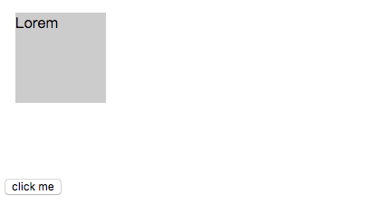
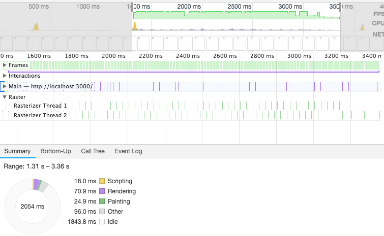
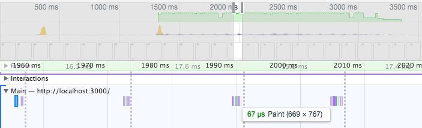
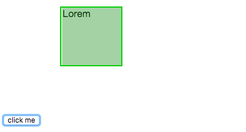
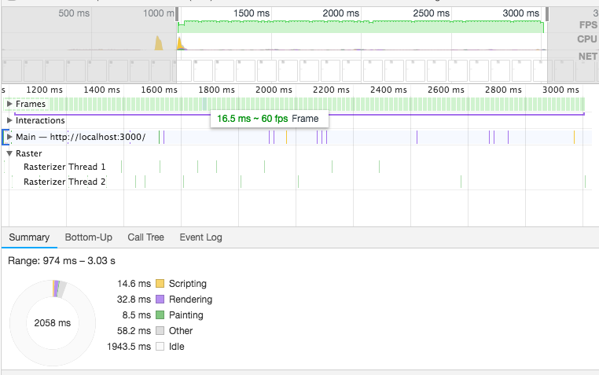

## 什么是动画

浏览器的动画原理和翻页动画类似，通过不断更新绘制 DOM 和 CSS 形成的动画，绘制的速度够快，人眼就察觉不出每一帧的间隔，视觉上就是连续的动画。大部分浏览器的刷新频率为 60Hz ，也就是一秒 60 帧。setInterval 或 setTimeout 做的动画根据人为定义的时间间隔绘制，如果间隔定义小于浏览器显示频率（16.7ms）假设为10ms，就会导致第三帧丢失。


### transition

在 css transition 之前，css 是没有时间轴的，也就是说，所有的状态变化，在一瞬间完成。有了 transition 之后，可以定义一个控件从一个状态过渡到另一个状态的“过渡过程”，浏览器会在过渡过程中填充一连串连续帧。transition 要求控件有明确的开始状态和结束状态，比如，height从0px变化到100px，transition可以算出中间状态。但是，transition没法算出0px到auto的中间状态，也就是说，如果开始或结束的设置是height: auto，那么就不会产生动画效果。类似的情况还有，display: none到block，background: url(foo.jpg)到url(bar.jpg)等等。

过渡效果被限制在始末两个状态，这决定了它们会缺少动效那样的细节处理，但同时它实现起来也更容易。

### 使用 transition

CSS transitions 可以决定哪些属性发生动画效果 (明确地列出这些属性)，何时开始 (设置 delay），持续多久 (设置 duration) 以及如何动画 (定义timing funtion，比如匀速地或先快后慢)。

并不是所有的 css 属性都可以动画。[可动画属性列表](https://developer.mozilla.org/zh-CN/docs/Web/CSS/CSS_animated_properties)是一个有限集合。

定义一个过渡效果，有以下 css 属性：

 - transition-property 指定哪个或哪些 CSS 属性用于过渡。只有指定的属性才会在过渡中发生动画，其它属性仍如通常那样瞬间变化。
 - transition-duration 指定过渡的时长。或者为所有属性指定一个值，或者指定多个值，为每个属性指定不同的时长。
 - transition-timing-function 指定一个函数，定义属性值怎么变化。缓动函数 Timing functions 定义属性如何计算。
 - transition-delay 指定延迟，即属性开始变化时与过渡开始发生时之间的时长。

简写语法：

```javascript
transition: <property> <duration> <timing-function> <delay>;
```

### animation

transition 有许多限制，比如：

 - 控件的状态只有两个：开始状态和结束状态
 - transition 的具体动画效果是绑定在具体控件上的，如果想要为多个元素声明同样的 transition ，需要为所有元素书写 transition 属性。
 - 过渡效果需要事件触发，如 hover，元素淡入淡出。
 - transition 一般只发生一次，不会重复触发。

animation（动效） 则可以解决以上问题。动效可以让你添加很多中间状态，并提供了更高的控制程度，而不必依赖于始末两个状态。

### 使用 animation

动效是通过对 [keyframes（关键帧）](https://developer.mozilla.org/zh-CN/docs/Web/CSS/@keyframes)的使用设置实现的。过渡效果能在一个类中的一行被指定，而动效能在 CSS 里单独用一系列关键帧被指定。

定义动效的 css 属性：

 - animation-name 指定应用的一系列动画，每个名称代表一个由 @keyframes 定义的动画序列。
 - animation-duration 指定一个动画周期的时长。默认值是 0s ，表示无动画。
 - animation-timing-function 定义CSS动画在每一动画周期中执行的节奏。可能值为一或多个 [<timing-function>](https://developer.mozilla.org/zh-CN/docs/Web/CSS/timing-function)。
 - animation-delay 定义动画于何时开始，即从动画应用在元素上到动画开始的这段时间的长度。默认值 0s 代表动画在应用到元素上后立即开始执行。
 - animation-iteration-count 定义动画在结束前运行的次数。可以是1次，可以是无限循环。默认值是 1 。
 - animation-direction 指示动画是否反向播放。
 - animation-fill-mode 指定在动画执行之前和之后如何给动画的目标应用样式。
 - animation-play-state 定义一个动画是否运行或者暂停。可以通过查询它来确定动画是否正在运行。另外，它的值可以被设置为暂停和恢复的动画的重放。默认值是 running 。

当相关 animation 属性不多，可以简写。

```javascript
animation: <name> <duration> <timing-function> <delay> <iteration-count> <direction>
```

### js 动画

[window.requestAnimationFrame()](https://developer.mozilla.org/zh-CN/docs/Web/API/Window/requestAnimationFrame) 方法告诉浏览器您希望执行动画并请求浏览器在下一次重绘之前调用指定的函数来更新动画。该方法使用一个回调函数作为参数，这个回调函数会在浏览器重绘之前调用。

## 动画和性能

关于 css 硬件加速，查到的资料大概都是16年之前的（那时的 Chrome 还有 Timeline 面板=。=现在应该叫 Performance 了）。
资料如下：

> [CSS硬件加速的好与坏](http://efe.baidu.com/blog/hardware-accelerated-css-the-nice-vs-the-naughty/)
> 
> [CSS动画之硬件加速](https://www.aliyun.com/jiaocheng/664245.html)

### 层叠上下文

[css 层叠上下文](https://developer.mozilla.org/zh-CN/docs/Web/Guide/CSS/Understanding_z_index/The_stacking_context) 或者说图层，是HTML元素的三维概念，这些HTML元素在一条假想的相对于面向（电脑屏幕的）视窗或者网页的用户的z轴上延伸，HTML元素依据其自身属性按照优先级顺序占用层叠上下文的空间。

文档中的层叠上下文由满足以下任意一个条件的元素形成：

 - 根元素 (HTML),
 - z-index 值不为 "auto"的 绝对/相对定位，
 - 一个 z-index 值不为 "auto"的 flex 项目 (flex item)，即：父元素 display: flex|inline-flex，
 - opacity 属性值小于 1 的元素（参考 the specification for opacity），
 - transform 属性值不为 "none"的元素，
 - mix-blend-mode 属性值不为 "normal"的元素，
 - filter值不为“none”的元素，
 - perspective值不为“none”的元素，
 - isolation 属性被设置为 "isolate"的元素，
 - position: fixed
 - 在 will-change 中指定了任意 CSS 属性，即便你没有直接指定这些属性的值
 - -webkit-overflow-scrolling 属性被设置 "touch"的元素

每个层叠上下文完全独立于它的兄弟元素：当处理层叠时只考虑子元素。

### top + absolute 实现的动画

我写了一个 [demo](https://codepen.io/sheepig-the-bashful/full/ZMNbJM)，点击 click ，盒子的 left 变为 200px 。transition 定义的过渡。



动画的执行的过程中，发生了多次 repaint 。



查看主线程，主线程做了很多次 paint 。



如果在 chrome 开发者工具中开启 Rendering 面板的 “Painting flashing”，页面中 repaint 区域会被绿色蒙板高亮出来。可以看到动画过渡过程中，灰色盒子有一层闪烁的绿色蒙板。



绝对定位会建立一个新的图层，而此图层上只有当前一个元素，多以只会 repaint ，而不会 reflow 。

在这个例子中，对于动画的每一帧，浏览器会计算元素的几何形状，渲染新状态的图像，并把它们发送给GPU。尽管浏览器做了优化，在repaint时，只会repaint部分区域，但是我们的动画仍然不够流畅。如果这时在主线程运行一些耗时的任务，动画的帧数可能远达不到 60 帧，甚至低于人眼对帧数的分辨率，视觉上出现“卡顿”效果。

### transform 实现的动画

用 transform 改写上面的例子，得到渲染过程如下：



显然浏览器花在 paint 的时间少的不止一星半点，动画演示期间并没有过多的 repaint 。简单说，[transform](https://csstriggers.com/transform) 不触发几何变化和绘制，它可以在 GPU 加速下，在**合成器线程（compositor thread）**中处理。

### GPU 加速

浏览器接收到页面文档后，会将文档中的标记语言解析为DOM树。DOM树和CSS结合后形成浏览器构建页面的渲染树。渲染树构建完之后，浏览器要做的就是：reflow/layout -> repaint -> composite 。渲染树中包含了大量的渲染元素，每一个渲染元素会被分到一个图层中，每个图层又会被加载到GPU形成渲染纹理。图层在 GPU 中 transform 是不会触发 repaint 的，最终这些使用 transform 的图层都会由独立的合成器线程进行处理。

现代浏览器大都可以利用GPU来加速页面渲染。在GPU的众多特性之中，它可以存储一定数量的纹理（一个矩形的像素点集合）并且高效地操作这些纹理（比如进行特定的移动、缩放和旋转操作）。这些特性在实现一个流畅的动画时特别有用。浏览器不会在动画的每一帧都绘制一次，而是生成DOM元素的快照，并作为GPU纹理（也被叫做层）存储起来。之后浏览器只需要告诉GPU去转换指定的纹理来实现DOM元素的动画效果。这就叫做GPU合成，也经常被称作『硬件加速』。

所以产生 GPU 加速的条件如下：

1. 动画会使它所在的元素提升为复合层（一个层叠上下文，比如绝对定位和 transform ），因此不发生 reflow 。

2. 图层在 GPU 中不引起 repaint ，【目前只有 transform 和 opacity】，因此不发生 repaint 。

另外，transform3D 和 2D 的区别在于 3D 渲染前便会产生新的图层，而 2D 是在运行时产生图层，运行结束时删除图层。

浏览器将a元素提升为一个复合层有很多种原因，下面列举了一些：

 - 3d或透视变换css属性，例如translate3d,translateZ等等（js一般通过这种方式，使元素获得复合层）

 - <video><iframe><canvas><webgl>等元素。

 - 混合插件（如flash）。

 - 元素自身的 opacity和transform 做 CSS 动画。

 - 拥有css过滤器的元素。

 - 使用will-change属性。

 - 绝对定位

 - 元素有一个 z-index 较低且包含一个复合层的兄弟元素(换句话说就是该元素在复合层上面渲染)

## GPU 加速可能带来的问题

### GPU是如何合成图像的

GPU实际上可以看作一个独立的计算机，它有自己的处理器和存储器及数据处理模型。当浏览器向GPU发送消息的时候，就像向一个外部设备发送消息。

你可以把浏览器向GPU发送数据的过程，与使用ajax向服务器发送消息非常类似。想一下，你用ajax向服务器发送数据，服务器是不会直接接受浏览器的存储的信息的。你需要收集页面上的数据，把它们放进一个载体里面（例如JSON），然后发送数据到远程服务器。

同样的，浏览器向GPU发送数据也需要先创建一个载体；只不过GPU距离CPU很近，不会像远程服务器那样可能几千里那么远。但是对于远程服务器，2秒的延迟是可以接受的；但是对于GPU，几毫秒的延迟都会造成动画的卡顿。

浏览器向GPU发送的数据载体是什么样？这里给出一个简单的制作载体，并把它们发送到GPU的过程。

 - 画每个复合层的图像

 - 准备图层的数据

 - 准备动画的着色器（如果需要）

 - 向GPU发送数据

所以你可以看到，每次当你添加transform:translateZ(0)或will-change：transform给一个元素，你都会做同样的工作。重绘是非常消耗性能的，在这里它尤其缓慢。在大多数情况，浏览器不能增量重绘。它不得不重绘先前被复合层覆盖的区域。

### 隐式合成

https://www.smashingmagazine.com/2016/12/gpu-animation-doing-it-right/


> 参考文章
>
> [Transitions vs Animations](https://cssanimation.rocks/transition-vs-animation/)
>
> [CSS动画简介](http://www.ruanyifeng.com/blog/2014/02/css_transition_and_animation.html)
>
> [[译] JavaScript 是如何工作的：CSS 和 JS 动画背后的原理 + 如何优化性能](https://juejin.im/post/5afaea6b6fb9a07aa34a6a74)
>
> [CSS GPU Animation: Doing It Right](https://www.smashingmagazine.com/2016/12/gpu-animation-doing-it-right/)
