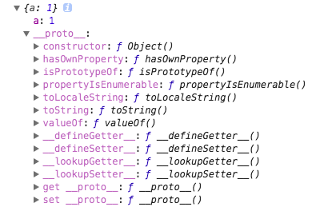
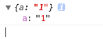
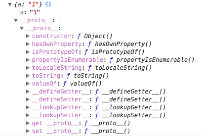
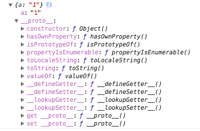

> 参考[【第1244期】详解Object.create(null)](https://mp.weixin.qq.com/s/HiEk_HHySMdTUUatLdjarQ)

## Object.create()
MDN上定义：`Object.create()`方法创建一个新对象，使用现有的对象来提供新创建的对象的`__proto__`。 
`Object.create(proto,[propertiesObject])`

- proto:新创建对象的原型对象
- propertiesObject：可选。如果没有指定为`undefined`，则是要添加到新创建对象的可枚举属性（即其自身定义的属性，而不是其原型链上的枚举属性）对象的属性描述符以及相应的属性名称。这些属性对应`Object.defineProperties()`的第二个参数。

借用原文作者的:chestnut:
```javascript
const car = {
  isSportsCar: false,
  introduction: function () {
    console.log(`Hi girl, this is a ${this.name}. 
    Do you like to have a drink with me ? ${this.isSportsCar}`);
  }
};
const porsche = Object.create(car,{
    //color成为porsche的数据属性
    //颜色不喜欢，可以改色或贴膜，所以可修改
    color:{
        writable:true,
        configurable:true,
        value:'yellow'
    },
    //type成为porsche的访问器属性
    type:{
        // writable、configurable等属性，不显式设置则默认为false
        // 想把普通车改成敞篷，成本有点大了，所以就设成不可配置吧
        get:function(){return 'convertible'},
        set:function(value){"change this car to",value}
    }
});
porsche.name = "Porsche 911"; // "name"是"porsche"的属性, 而不是"car"的
porsche.isSportsCar = true; // 继承的属性可以被覆写
porsche.introduction();
// expected output: "Hi girl, this is a Porsche 911. Do you like to have a drink with me ? true"
```
## Object.create()、{…}的区别
### 使用`{}`创建到对象
```javascript
var o = {
    a: 1
};
```

从上图可以看到，新创建的对象继承了Object自身的方法，如`hasOwnProperty`、`toString`等，在新对象上可以直接使用。

### Object.create()
```javascript
var o = Object.create(null,{
    a:{
           writable:true,
        configurable:true,
        value:'1'
    }
})
console.log(o);
```


可以看到，新创建的对象除了自身属性a之外，原型链上没有任何属性，也就是没有继承Object的任何东西，此时如果我们调用`o.toString()`会报Uncaught TypeError的错误。

大家可能会注意到，第一个参数使用了`null`。也就是说将`null`设置成了新创建对象的原型，自然就不会有原型链上的属性。我们再把上面的例子改一改：
```javascript
var o = Object.create({},{
    a:{
           writable:true,
        configurable:true,
        value:'1'
    }
})
console.log(o)
```
将null改为`{}`，结果是怎样的？在chrome控制台打印如下：


我们看到，这样创建的对象和使用`{}`创建对象已经很相近了，但是还是有一点区别：多了一层`__proto__`嵌套。

最后再修改一下：
```javascript
var o = Object.create(Object.prototype,{
    a:{
           writable:true,
        configurable:true,
        value:'1'
    }
})
console.log(o)
```
控制台打印如下：


这次就和使用`{}`创建的对象一模一样了。
### Object.create(null)的使用场景
为什么很多源码作者会使用`Object.create(null)`来初始化一个新对象呢？这是作者的习惯，还是一个最佳实践？

其实都不是，这并不是作者不经思考随便用的，也不是javascript编程中的最佳实践，而是需要因地制宜，具体问题具体分析。

使用create创建的对象，没有任何属性，我们可以把它当作一个非常纯净的map来使用，我们可以自己定义hasOwnProperty、toString方法，不管是有意还是不小心，我们完全不必担心会将原型链上的同名方法覆盖掉。举个:chestnut:
```javascript
//Demo1:
var a= {...省略很多属性和方法...};
//如果想要检查a是否存在一个名为toString的属性，你必须像下面这样进行检查：
if(Object.prototype.hasOwnProperty.call(a,'toString')){
    ...
}
//为什么不能直接用a.hasOwnProperty('toString')?因为你可能给a添加了一个自定义的hasOwnProperty
//你无法使用下面这种方式来进行判断,因为原型上的toString方法是存在的：
if(a.toString){}
//Demo2:
var a=Object.create(null)
//你可以直接使用下面这种方式判断，因为存在的属性，都将定义在a上面，除非手动指定原型：
if(a.toString){}
```
另一个使用`create(null)`的理由是，在我们使用`for..in`循环的时候会遍历对象原型链上的属性，使用`create(null)`就不必再对属性进行检查了，当然，我们也可以直接使用`Object.keys[]`。
## 总结：
你需要一个非常干净且高度可定制的对象当作数据字典的时候；

想节省hasOwnProperty带来的一丢丢性能损失并且可以偷懒少些一点代码的时候
用`Object.create(null)`吧！其他时候，请用{}。
