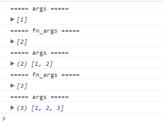
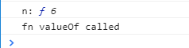

## 链式调用

实现 `add(2)(3)(4)...(n)` 。

### 代码

```javascript
function add(n) {
    var args = [].slice.call(arguments); // 闭包存储args
    console.log('===== args =====');
    console.log(args);
    
    var fn = function() {
        var fn_args = [].slice.call(arguments); // 合并参数
        console.log('===== fn_args =====');
        console.log(fn_args);
        return add.apply(null, args.concat(fn_args));
    }

    fn.valueOf = function() {
        console.log('fn valueOf called');
        return args.reduce((a, b) =>  a + b );
    }
    return fn;
}
```

### 调用

```javascript
var n = add(1)(2)(3);
```



试打印 `n` 的值，注意浏览器中 `console.log` 会尝试将n转换成字符串输出。此时有隐式转换发生。注意这个时候 `n` 是一个 `Function` 类型。



> `valueOf` 和 `toString` 方法：在特定的情况下，这俩个方法都会自动调用，而且在用户定义了新的 `valueOf` 和 `toString` 的时候，会优先执行新的方法。