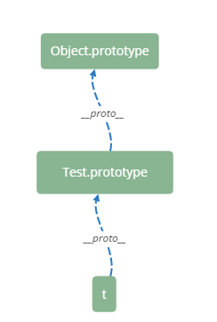

## new 操作符

写这篇的起因是一个面试题。

```javascript
Function.prototype.a = 1;
Object.prototype.b = 2;
function Test() {}
var t = new Test();
console.log(t.a); // undefined
console.log(t.b); // 2
```

MDN 上对 new 操作符的描述：

>当代码 `new Foo(...)` 执行时，会发生以下事情：
一个继承自 `Foo.prototype` 的新对象被创建。
使用指定的参数调用构造函数 `Foo` ，并将 `this` 绑定到新创建的对象。`new Foo` 等同于 `new Foo()`，也就是没有指定参数列表，`Foo` 不带任何参数调用的情况。
由构造函数返回的对象就是 `new` 表达式的结果。如果构造函数没有显式返回一个对象，则使用步骤1创建的对象。（一般情况下，构造函数不返回值，但是用户可以选择主动返回对象，来覆盖正常的对象创建步骤）。

`t.b` 为 `2` ，不难理解。`t` 的原型链情况如下：



注意 Test 对象是 Object 的实例。所以通过 Test 的原型链可以找到 Object 的原型对象。

所以，不难理解，有：

```javascript
Test.b; // 2
```

### `__proto__` && `prototype`

`__proto__` ：实例访问构造函数原型对象（`xx.prototype`）的桥梁

`xx.prototype` ：构造函数的原型对象

### Function.prototype

哪里能访问到 `a` ？

```javascript
Test.a; // 1
Test.__proto__ === Function.prototype         // true
```

`Test` 是 `Function` 的实例，所以可以访问 `Function.prototype` 的属性。new 操作符返回的是一个对象，但是这个对象和 `Function.prototype` 似乎断了关联。可以说构造函数是一个加工厂，它根据参数和本厂特有配置（`Test.prototype`）加工一个实例，每个实例可以有自己特有的属性，也被打上本厂标签（`Test.prototype`）。

### 单链原型链

`Object.prototype` 是整个原型链的顶端。

```javascript
Object.prototype.__proto__ // null
```

`Object` 本身是构造函数，继承自 `Function.prototype` 。

```javascript
Object.__proto__ === Function.prototype // true
```

`Function` 本身就是函数，`Function.__proto__` 是标准的内置对象 `Function.prototype` 。`Function.prototype.__proto__` 是标准的内置对象 `Object.prototype` 。（`Function.prototype` 是对象，继承自 `Object.prototype`）。

```javascript
Function.__proto__ === Function.prototype         // true
Function.prototype.__proto__ === Object.prototype // true
```

这里有一个先有鸡还是先有蛋的问题

```javascript
Object instanceof Function // true
Function instanceof Object // true
```

解决这个问题就是 `Function.__proto__ = Function.prototype` 。一张图说明一切


很明显，`new Foo(...)` 和 `Function.prototype` 没有联系。

### 实现 new 功能

定义一个 `_new` 功能函数，至少接受一个参数（构造函数）。

```javascript
function Test(value) {
    this.value = value;
}
Test.prototype.getValue = function() {
    return this.value;
}


function _new(constructor) {
    var obj = new Object();
    var args = [...arguments].slice(1);
    obj.__proto__ = constructor.prototype;
    constructor.apply(obj, args);
    return obj;
}

var t = _new(Test, 4);
```

如果 Test 构造函数有返回值，则对返回结果做一个判断，如果是对象则返回这个对象，否则返回 obj 。

```javascript
function _new(constructor) {
    var obj = new Object();
    var args = [...arguments].slice(1);
    obj.__proto__ = constructor.prototype;
    var ret = constructor.apply(obj, args);
    return typeof ret === 'object' ? ret : obj;;
}
```

