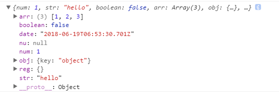
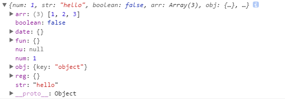
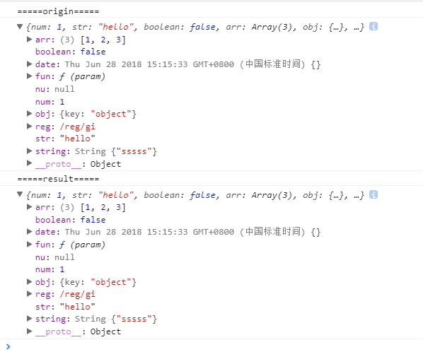
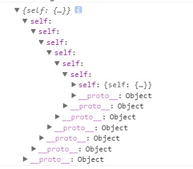

> 参考
> 
> [JavaScript深拷贝的一些坑](https://juejin.im/post/5b235b726fb9a00e8a3e4e88)
> 
> [ife2015-对象深拷贝](https://github.com/baidu-ife/ife/blob/master/2015_spring/task/task0002/review/demo/js/util_demo.js)

## 对象深拷贝

常用的方法 `JSON.parse(JSON.stringify(obj))`，或者 `for..in` 递归拷贝。

现在有一个这样的对象：

```javascript
var origin = {
    num: 1,
    str: 'hello',
    boolean: false,
    arr: [1, 2, 3],
    obj: {key: 'object'},
    fun: function(){ console.log('func');},
    date: new Date(),
    reg: /reg/ig,
    nu: null
}
```

用`JSON.parse(JSON.stringify(origin))`拷贝的结果：普通对象和数组都能拷贝，然而`date`对象成了字符串，函数直接就不见了，正则成了一个空对象。

;

递归拷贝结果：

;

通过上面的测试可知，这两个方法都无法拷贝函数，`date`，`reg`类型的对象;

### 类型判断

拷贝之前，对数据类型做类型判断，比较稳妥的方法是用 `Object.prototype.toString.call(obj)` ，MDN释义如下：

每个对象都有一个`toString()`方法，当该对象被表示为一个文本值时，或者一个对象以预期的字符串方式引用时自动调用。默认情况下，`toString()`方法被每个Object对象继承。如果此方法在自定义对象中未被覆盖，`toString()` 返回 `"[object type]"`，其中type是对象的类型。

我们只对基本数据类型，外加`Date`, `RegExp`, 进行深复制，Object 对象限制为字面量对象。更多数据类型复制，可以看 [lodash](https://github.com/lodash/lodash/blob/master/.internal/baseClone.js)。

### 字面量对象判断

判断一个对象是不是字面量对象，即判断这个对象是不是由`{}`或者`new Object`类似方式创建。

```javascript
/**
 * 判断一个对象是不是字面量对象，即判断这个对象是不是由{}或者new Object类似方式创建
 * @param {*} obj 
 * @returns {boolean} 
 */
function isPlain(obj) {
    let hasOwnProperty = Object.prototype.hasOwnProperty;
    let key;
    if (!obj || 
        // 一般情况下直接用Object.prototype.toString.call
        Object.prototype.toString.call(obj) !== '[object Object]' ||
        // isPrototypeOf 挂在 Object.prototype 上的，因此所有的字面量都应该会有这个属性
        // 对于在 window 上挂了 isPrototypeOf 属性的情况，直接忽略不考虑
        !('isPrototypeOf' in obj)
        ) {
            return false;
    }
    // 判断new fun()自定义对象的情况
    // constructor不是继承自原型链的
    // 并且原型中有 isPrototypeOf 方法才是 Object
    if (obj.constructor && 
        ! hasOwnProperty.call(obj, 'constructor') &&
        ! hasOwnProperty.call(obj.constructor.prototype, 'isPrototypeOf')
        ) {
            return false;
    }
    // 判断有继承的情况
    // 如果有一项是继承过来的，那么一定不是字面量 Object
    // OwnProperty 会首先被遍历，为了加速遍历过程，直接看最后一项
    for ( key in obj ) {}
    return key === undefined || hasOwnProperty.call( obj, key );
}
```

### 对象clone

```javascript
function cloneObject(source) {
    var result = source, len, i;
    // null, undefined, 或者通过 new Number, new String, new Boolean 创建
    if (!source ||
        source instanceof Number ||
        source instanceof String ||
        source instanceof Boolean
    ){
        return result;
    }
    var type = Object.prototype.toString.call(source);
    switch (type) {
        case '[object Array]':
            result = [];
            var resultLen = 0;
            for (i = 0, len = source.length; i < len; i++) {
                result[resultLen++] = cloneObject(source[i]);
            }
            break;
        case '[object Date]':
            result = new Date(source.getTime());
            break;
        case '[object RegExp]':
            result = new RegExp(source);
            break;
        default: 
            if (isPlain(source)) {
                result = {};
                for (key in source) {
                    if (source.hasOwnProperty(key)) {
                        result[key] = cloneObject(source[key]);
                    }
                }
            }
    }
    return result;
}
```

clone 结果：



### 环的拷贝

```javascript
var origin = {};
origin.self = origin;
```



可以使用一个`WeakMap`结构存储已经被拷贝的对象，每一次进行拷贝的时候就先向`WeakMap`查询该对象是否已经被拷贝，如果已经被拷贝则取出该对象并返回。

```javascript
function isObj(obj) {
    return (typeof obj === 'object' || typeof obj === 'function') && obj !== null
}
function deepCopy(obj, hash = new WeakMap()) {
    if(hash.has(obj)) return hash.get(obj)
    let cloneObj = Array.isArray(obj) ? [] : {}
    hash.set(obj, cloneObj)
    for (let key in obj) {
        cloneObj[key] = isObj(obj[key]) ? deepCopy(obj[key], hash) : obj[key];
    }
    return cloneObj
}
```
