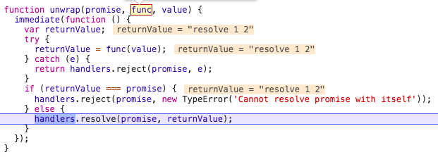
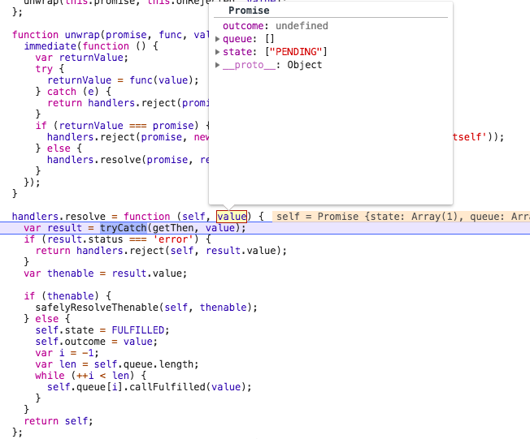

> 本文相关术语见 Promise A+ 规范

> [解析 lie 库的 Promise](../promise/note.md)

### 异步编程 Promise

许多讲 Promise 的文章，喜欢提及 Promise 解决回调地狱的能力。Promise 拥有这能力，本质是它有一个 then 方法，用以访问最终的 reason 或 value 。只有当当前 promise 实例的状态不是 PENDING 时，才会去注册它的 resolve 回调或者 reject 回调。为确保回调函数会执行，要在新建 Promise 的时候显式调用 resolve 或 reject （或者使用 Promise.resolve() Promise.reject() ）

then 方法中，我们可以做三件事：

1. return 一个同步的值或者是 undefined
2. return 一个 promise 对象
3. 同步的 throw 一个错误

#### return 一个同步的值或者是 undefined

```javascript
var p1 = new Promise((resolve) => {
  resolve('resolve 1');
}).then((v1) => {
  console.log(v1);
  return v1 + ' 2'
}).then((v2) => {
  console.log(v2)
})
```

上面的例子是同步 resolver ，代码走到第一个 `.then(...)` 的时候，会新建一个 promise 实例，暂且把它搁一边，记为 p2 吧。下一步异步调用回调，这里就是 `(v1) => {...}` 这个方法。入参 v1 的值是 p1 的最终 value （p1 已经 resolved）。



在执行 `(v1) => {...}` 回调的时候，我们得到一个返回值，它是一个同步的值。由于同步值没什么好操作的，蓝色行其实就是 handler.resolve(p2, v1+ ' 2')，结果我们把 p2 的状态转为 FULFILLED ，把 p2 的 outcome 设为该同步值。

这一步的 return 语句很关键，没有返回值的话，p2 最终的 value 将是 undefined ，那么最后一个 then 方法是无法访问 p2 的 value 的。

关于异步 resolver ，道理也是一样的，牢记 then 里面的回调，只有在 promise 的状态不为 PENDING 的时候才注册。

#### return 一个 promise 对象

异步 resolver 可以实现 p2 等待 p1 这种效果

```javascript
var p1 = new Promise((resolve) => {
  setTimeout(() => {
    resolve('resolve 1');
  }, 2000)
}).then((value) => {   // p2
  console.log(value);  // waiting for 2s
});
```

如果我希望不止 p1 可以异步 resolve，p2 也要延迟 resolve，甚至后面多写几个 `.then(...)` 这种东西，它们的 resolve 也是异步的，该怎么写？在 then 的回调参数里面没有 resolver 可以用。

仔细想想，p2 之所以不会延迟 resolve ，是因为我们在执行 `handlers.resolve(p2, value)` 时，我们给它传了一个同步值，p2 直接就获取到这个值。如果我们不在 then 的回调参数里面返回同步值，而是返回一个新的 promise ，这个 promise 就可以做到异步延迟 resolve/reject ，最终会有一个不变的 value 或 reason，那么 p2 的 outcome 是不是就由这个 promise 的表现决定，也具有异步特性呢？

还是看第一个 then 调用的时候发生了什么。前面几步和上一个例子一样，直接看 handler.resolve 这一步



这里参数 value 就是在第一个 then 的回调函数里面返回的 `new Promise(...)` ，我们判定它是一个 thenable 对象，走 if 分支，即执行  safelyResolveThenable 。

result 的值是 getThen 函数的结果，其实是返回 then 的调用。

```javascript
function getThen(obj) {
  // Make sure we only access the accessor once as required by the spec
  var then = obj && obj.then;
  if (obj && (typeof obj === 'object' || typeof obj === 'function') && typeof then === 'function') {
    return function applyThen() {
      then.apply(obj, arguments);
    };
  }
}
```
我们提取出来的 thenable 其实就是上面的 applyThen ，顾名思义就是 promise.then 的调用。这里的 promise 绑定的是 `return new Promise(...)` 的那个，我们把它称为 dummy 吧。

这里有一个蛮巧妙的思路，safelyResolveThenable 的时候，self 是 p2，而 thenable 是绑定在 dummy 上的一个 then 的调用。这样讲有点拗口，我们把它看成 `dummy.then` 就好。所以 p2 的状态和 outcome，将由 dummy 决定，代码拆分如下：

```javascript
// 关联 dummy 的状态和 p2 的状态

var dummy = Promise.resolve((resolve) => {
  setTimeout(() => {
    console.log('sleep 2s');
    resolve('resolve 2');
  }, 2000)
});

// 2s 后注册 dummy 的回调
// dummy resolved -> p2 resolved 
// dummy.outcome -> p2.outcome
```

p2 的状态转换取决于另一个 promise，这就是异步的关键。

最后再看一下这段代码，里面的 then 回调都是什么时候注册的？

```javascript
var p1 = new Promise((resolve) => { // p1
  resolve('resolve 1');
}).then((v1) => {                   // p2
  console.log(v1);
  return new Promise((resolve) => { // dummy
    setTimeout(() => {
      console.log('sleep 2s');
      resolve('resolve 2');
    }, 2000)
  })
}).then((v2) => {                   
  console.log(v2)
})
```

注册顺序：

p1

2s后 dummy resolved，p2 注册回调


#### 基于 promise 的异步队列

有了上面 then 回调中返回 promise 的技巧，很容易实现一个异步队列。保持一个 promise实例，每次 then 注册的回调都是返回 new Promise，那么靠后的 then 回调的注册依赖前一个 promise 的状态。

比如这个题目：

要求1：按以下要求输出

```javascript
human('Jack').eat().sleep(5).go().rest(10);
// I am Jack
// Eat
// 等 5 秒
// Sleep 1s
// Go
// 等 10 秒
// Rest 10s
```

要求2：eat/sleep/go/rest可以改变任意顺序

```javascript
human('Jack').sleep(5).eat().rest(10).go();
```

在每次调用 sleep、rest 这种带有定时的操作的时候，我们希望下一个操作会被阻塞，直到当前的操作执行完毕后，下一个操作才会被执行，这种情况就和上面的 then 回调返回一个异步 resolve 的 promise 的节奏是一样的。

```javascript
function Human(name) {
  this.name = name;
  this.greeting();
  this.queue = Promise.resolve();
}

function human(name) {
  return new Human(name);
}

Human.prototype.greeting = function () {
  console.log(`I am ${this.name}`);
}

Human.prototype.eat = function() {
  this.queue = this.queue.then(() => {
    return new Promise((resolve) => {
      console.log('Eat');
      resolve();
    })
  });
  return this;
}

Human.prototype.go = function() {
  this.queue = this.queue.then(() => {
    return new Promise((resolve) => {
      console.log('Go');
      resolve();
    })
  });
  return this;
}

Human.prototype.sleep = function(sec) {
  this.queue = this.queue.then(() => {
    return new Promise((resolve) => {
      setTimeout(() => {
        console.log(`Sleep ${sec}s`);
        resolve();
      }, sec * 1000);
    })
  });
  return this;
}

Human.prototype.rest = function(sec) {
  this.queue = this.queue.then(() => {
    return new Promise((resolve) => {
      setTimeout(() => {
        console.log(`Rest ${sec}s`);
        resolve();
      }, sec * 1000);
    })
  });
  return this;
}
```

> 参考文章
>
>[谈谈使用 promise 时候的一些反模式](http://efe.baidu.com/blog/promises-anti-pattern/)
>
>[We have a problem with promises](https://pouchdb.com/2015/05/18/we-have-a-problem-with-promises.html)