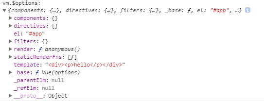
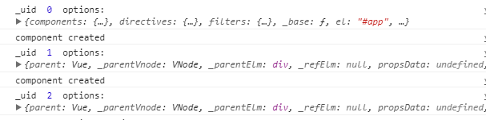
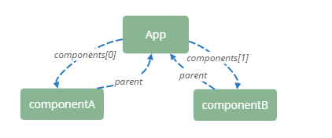

## info
Vue Version: `2.3.3` 。

用来调试打 console.log 的文件是 `dist/vue.js` 。默认开发环境，直接在 html 文档中 用 script 引入这个文件。

源码引自 `dist/vue.esm.js` 。

为了方便书写，行文中用 vm 指代 Vue 实例。

## new Vue(options)

每一 Vue 实例，都是通过 Vue 构造函数创建的。

```javascript
function Vue (options) {
  if (process.env.NODE_ENV !== 'production' &&
    !(this instanceof Vue)
  ) {
    warn('Vue is a constructor and should be called with the `new` keyword');
  }
  this._init(options);
}
```

定义这个构造函数后，对 Vue 还做了以下这些：

```javascript
initMixin(Vue);
stateMixin(Vue);
eventsMixin(Vue);
lifecycleMixin(Vue);
renderMixin(Vue);
```

字面意义上理解，这里对以后通过 `new Vue()` 创建成的 vm ，初始化一系列属性、方法、生命周期，最后挂载。

### initMixin(Vue)

在这个方法中，定义了 Vue 原型对象上的方法 `_init` 。

大致把 _init 的过程拆分如下：

 - merge options
 - initProxy
 - initLifecycle
 - initEvents
 - initRender
 - callHook(vm, 'beforeCreated')
 - initInjections(vm)
 - initState(vm)
 - initProvide(vm)
 - callHook(vm, 'created')
 - vm.$mount

#### merge options

尝试一个最简单的例子：

```javascript
var App = '<div><p>hello</p></div>';

new Vue({
    el: '#app',
    template: App
});
```

这一步的最终目的，是把 merged options 挂在 vm 的属性 `$options` ：



但是入参 options 只提供了 el，template 这两个属性，其他属性是怎么来的呢？

答案是 mergeOptions(parent, child, vm) 。沿着 vm 的原型链查找到的最顶级祖先对象（本质是一个构造函数），一路更新每层节点的 options 。并且收集这些 options ，构成合成的 options 的一个来源：parent 。 child，也就是入参 options ，解析 child 的 props、inject、directives 为规定的对象格式；如果 child 有 extends、mixins，还要把这些选项 merge 进 parent。

主要关心一个 merge 的策略。这里用 defaultStrat ：

```javascript
var defaultStrat = function (parentVal, childVal) {
  return childVal === undefined
    ? parentVal
    : childVal
};
```

实际上做的是先把 perent 的 key-value 放到一个空对象（最终返回的对象），再把 child 中 key 的值不存在于刚刚那个对象的 key-value 值放进去。所以如果有同名属性，parent 的会覆盖 child 中的。

#### initProxy(vm)

开发环境下会执行这一步。

[Proxy](https://developer.mozilla.org/zh-CN/docs/Web/JavaScript/Reference/Global_Objects/Proxy) 定义：Proxy 对象用于定义基本操作的自定义行为（如属性查找，赋值，枚举，函数调用等）。

```javascript
var handlers = options.render && options.render._withStripped
    ? getHandler
    : hasHandler;
vm._renderProxy = new Proxy(vm, handlers);
```

其中 getHandler 和 hasHandler 定义了访问 vm 的属性时候的自定义行为。 hasHandler 对给定的属性，如果 vm 有这个属性，且该属性不是一些全局都能访问的方法或类（undefined、parseInt、Date、Array...具体查看 allowedGlobals ），也不是 Vue 对象内部自有属性（`_` 开头，比如 `_isVue` `_self` ...）则返回 true ，否则返回 false 。getHandler 定义 访问 vm 的属性时候的自定义行为。返回对应的属性的值。

这里的 Proxy 就行一道安检，在开发环境时访问 vm 的任何属性的时候，对访问不到的属性打出 warning ，方便开发时候 debug 。

#### initLifecycle(vm)

丰富一下前面的例子：

```javascript
var App = '<div><p>hello</p><component-a></component-a><component-b></component-b></div>';

var componentA = {
    template: '<div>componentA</div>'
};
var componentB = {
    template: '<div>componentB</div>'
};

new Vue({
    el: '#app',
    template: App,
    components: {
        'component-a': componentA,
        'component-b': componentB
    }
});
```

这里有三个组件，在 initLifecycle 中，把它们的 `$options` 属性打印出来看看



有三个组件被创建，并且初始化生命周期。这里还可以看出初始化顺序：根组件（`new Vue` 创建），然后根据 `App` 组件中，组件被添加的顺序，依次创建初始化两个组件 `componentA` 和 `componentB` 。

从组件的 `$options` 上看，以上三个组件有这样的联系：

;

每一个子组件都有一个 `parent` 属性，这个属性记录了父元素的 VNode 信息。

;

initLifecycle(vm) 时，vm 的 `watcher` 为空，`_isMounted` `_isDestoryed`  `_isBeingDestoryed` 的标记都为 false，此时组件还未挂载。

#### initEvents(vm)

更新子组件 vm 上，它的父组件绑定在当前组件上的事件（不包含子组件自身的 methods 和钩子函数）。

这里绑定的事件类型，包括click，hover等需要交互的事件吗？？

看一个稍微复杂的 :chestnut:

```javascript
var App = 
    `<div>
        <child
            @hook:created="hookFromApp"
            :appMsg="msg">
        </child>
    </div>`;

var Child = Vue.component('child', {
    template: '<div>{{appMsg}}</div>',
    data: function () {
        return {
            childMsg: 'msg from child'
        }
    },
    props: ['appMsg'],
    methods: {
        showChildMsg() {
            console.log(this.childMsg);
        }
    },
    created() {
        console.log('child created');
    },
    mounted() {
        console.log('child mounted');
    }
});

new Vue({
    el: '#app',
    template: App,
    data: function(){
        return {
            msg: 'msg from app'
        }
    },
    components: {
        Child
    },
    methods: {
        hookFromApp() {
            console.log('hook event');
        },
        clickFromApp() {
            console.log('attch event')
        }
    },
    created() {
        console.log('app created');
    },
    mounted() {
        console.log('app mounted');
    }
});
```

执行顺序是 

```
app created
child created
hook event
child mounted
app mounted
```

`hookFromApp` 方法是 App 的，但是我们实际调用它的时候是在 Child created 的时候。而且调用这个函数的时候 `this` 的指向会指向 Child 。
简而言之，`initEvent(vm)` 使我们可以在外部组件的环境中，给子组件绑定来自父组件的事件。

updateListeners 时，遍历 listeners 时候用的是 `for..in` ，会沿着原型链从 vm 回溯到根组件（不确定是根组件，还是最外层组件）。

```javascript
function updateListeners (
  on,        // listeners from vm.$options._parentListeners
  oldOn,     // initEvents 时，为 {}
  add,       // function
  remove$$1, // function
  vm         // vm 
) {
    var name, def, cur, old, event;
    for (name in on) {
        def = cur = on[name];
        old = oldOn[name];
        event = normalizeEvent(name);
        if (isUndef(cur)) {
          "development" !== 'production' && warn(
            "Invalid handler for event \"" + (event.name) + "\": got " + String(cur),
            vm
          );
        } else if (isUndef(old)) {
          if (isUndef(cur.fns)) {
            cur = on[name] = createFnInvoker(cur);
          }
          add(event.name, cur, event.once, event.capture, event.passive, event.params);
        } else if (cur !== old) {
          old.fns = cur;
          on[name] = old;
        }
    }
    for (name in oldOn) {
        if (isUndef(on[name])) {
            event = normalizeEvent(name);
            remove$$1(event.name, oldOn[name], event.capture);
        }
    }
}
```

normalizedEvent 对事件“格式化”，最后是一个类似这样的对象

```javascript
{
    capture: false,
    name: "hook:created",
    once: false,
    passive: false
}
```

如果事件有[修饰符](https://cn.vuejs.org/v2/guide/events.html#%E4%BA%8B%E4%BB%B6%E4%BF%AE%E9%A5%B0%E7%AC%A6)，信息也会被提取出来。处理子组件 vm 时。（注意起点是子组件的第一个外层组件）对每个 event ，都做缓存处理，所以回溯过程中遇到同名的 event ，取离 vm 更近的那个 event 。

`cur = on[name] = createFnInvoker(cur)` 这一步把 cur 变成一个“函数调用者”，返回绑定在 cur (来着父组件的函数）的调用。然后调用这个调用。调用者（target）是 **被绑定的对象** ，这里就是子组件 vm 。

【因为绑定事件经处理后就会执行，暂时猜测，需要交互的事件，如 click ，scroll 等，不被列入这类事件】

```javascript
function add (event, fn, once) {
  if (once) {
    target.$once(event, fn);
  } else {
    target.$on(event, fn);
  }
}
```

`target` 在这里指向 `Child` 。这个指向是怎么来的【待补充】

#### initRender(vm)

在这一步，vm 的 `_VNode` 被初始化为 `null` ；处理 slot 。

最重要的一步是数据劫持

```javascript
if (process.env.NODE_ENV !== 'production') {
    defineReactive(vm, '$attrs', parentData && parentData.attrs || emptyObject, function () {
      !isUpdatingChildComponent && warn("$attrs is readonly.", vm);
    }, true);
    defineReactive(vm, '$listeners', options._parentListeners || emptyObject, function () {
      !isUpdatingChildComponent && warn("$listeners is readonly.", vm);
    }, true);
  } else {
    defineReactive(vm, '$attrs', parentData && parentData.attrs || emptyObject, null, true);
    defineReactive(vm, '$listeners', options._parentListeners || emptyObject, null, true);
  }
```

defineReactive 对那些属性做了数据劫持？

```
// 来自 App
$attrs
$listeners
msg

// 来自 Child
$attrs
$listeners
appMsg
childMsg
```

`msg` 来自 `App` 的 `data` ，`childMsg` 来自 `Child` 的 `data` ，`appMsg` 来自 `Child` 的 `props` 。这些值被 defineReactive ，很好理解。那 `$attr` `$listener` 是指什么？`$attr` 包含的是父作用域中不作为 `prop` 被识别的( `class` / `style` 除外)特性。 `$listeners` 包含了父作用域中不含 `.native` 修饰器的事件监听( `v-on:` )。

合理使用这两个属性，可以优化一些父子组件通信。【[参考](https://www.jianshu.com/p/1ad071da3f36)】

这一步只对 vm 的 `$attr` `$listener` 做数据劫持。


