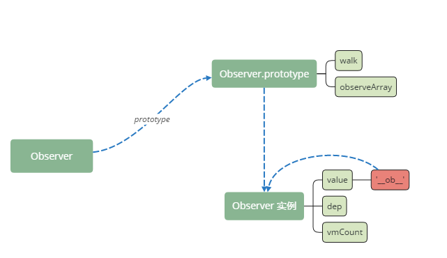
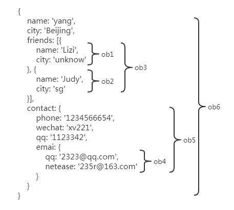
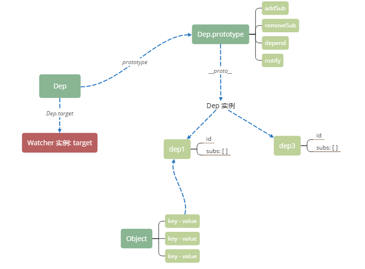
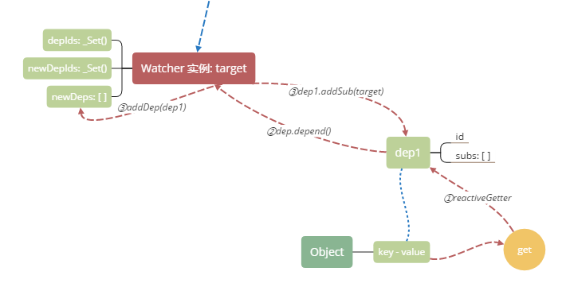

一个 vm ，什么属性会被 defineReactive ？

| obj | key&value|
|-----|----------|
| vm._props | * |
| vm | vm.$options.inject |
| vm | vm.$attr |
| vm | vm.$listener |
| vm._data | * |

```javascript
function defineReactive (
  obj,
  key,
  val,
  customSetter,
  shallow
) {
  var dep = new Dep();

  var property = Object.getOwnPropertyDescriptor(obj, key);
  if (property && property.configurable === false) {
    return
  }

  // cater for pre-defined getter/setters
  var getter = property && property.get;
  if (!getter && arguments.length === 2) {
    val = obj[key];
  }
  var setter = property && property.set;
  
  var childOb = !shallow && observe(val);
  Object.defineProperty(obj, key, {
    enumerable: true,
    configurable: true,
    get: function reactiveGetter () {
      var value = getter ? getter.call(obj) : val;
      if (Dep.target) {
        dep.depend();
        if (childOb) {
          childOb.dep.depend();
          if (Array.isArray(value)) {
            dependArray(value);
          }
        }
      }
      return value
    },
    set: function reactiveSetter (newVal) {
      var value = getter ? getter.call(obj) : val;
      /* eslint-disable no-self-compare */
      if (newVal === value || (newVal !== newVal && value !== value)) {
        return
      }
      /* eslint-enable no-self-compare */
      if (process.env.NODE_ENV !== 'production' && customSetter) {
        customSetter();
      }
      if (setter) {
        setter.call(obj, newVal);
      } else {
        val = newVal;
      }
      childOb = !shallow && observe(newVal);
      dep.notify();
    }
  });
}
```

一个 vm ，创建的 Dep 对象（订阅者）的数量，最基本就有 `vm.$attr` `vm.$listener` 带来的两个。data 的数据响应式是“深层次”的，也就是无论 data 对象嵌套多深，每一个嵌套的 key 都有一个 Dep 实例订阅。

defineReactive 支持自定义的 getter/setter 。


### Observer




与之相关主要是一个 observe 方法。该方法对一个字面量对象或者对象数组“深度observe”。具体例子如下

```javascript
{
    name: 'yang',
    city: 'Beijing',
    friends: [{
        name: 'Lizi',
        city: 'unknow'
    }, {
        name: 'Judy',
        city: 'sg'
    }],
    contact: {
        phone: '1234566654',
        wechat: 'xv221',
        qq: '1123342',
        emai: {
            qq: '2323@qq.com',
            netease: '235r@163.com'
        }
    }
}
```



最外层对象，认为是一个根对象，调用 observe 时候如果标记了 asRootData ，每次 observe 都会刷新 vmCount 的值。总的来看，observe 的顺序是自上而下，从里到外的。

在 initProps-validateProp 对 props 对象中每一个对象 observe ，不标记 asRootData 。
在 initData 对 data (`vm._data`) observe ，标记 asRootData 。
在 defineReactive 对 val（参数，对象 key——val）observe ，不标记 asRootData 。实际上是对 inject/provide 的 observe 。

可以看到 Observer 原型对象上有两个方法：`observeArray` `walk` 。`walk` 其实就是深度遍历 observe 的对象，对每一个属性 defineReactive 。如果遇到数组则依次 observe 每一项。

vm 本质是个对象，在初始化之外，通过 `vm.xx` 的方法添加的属性不会被设置数据响应。

```javascript
data: function() {
  return {
    a: 'reactive'     // 响应式
  }
}
vm.b = 'not reactive' // 非响应式
```

但是向已设置数据响应式的对象/数组新增项/删除项，会触发它们的 `getter/setter` ，因为它们也被 observe 了，即使看起来，我们好像只使用了它们里面的属性，或项。

```javascript
// 新增的 friends[2] 也会被 observe ，（有自己的 getter/setter）
this.friends.push({
  name: 'Ann',
  city: 'LA'
});

// 新增的 contact.zipCode 也会被 observe ，（有自己的 getter/setter）
this.contact.zipCode = '223312';

this.friends[2].city = 'unknow'; // 触发 getter/setter
this.contact.zipCode = '111111'; // 触发 getter/setter
```

### 订阅者 Dep



每一个 Dep 实例都维护一个 subs 数组，存放 Watcher 实例。



定义 getter 的时候，订阅——依赖收集。

看一个简单的例子

```javascript
var App = 
    `<div>
        <child></child>
        <component-a></component-a>
    </div>`;

var componentA = Vue.component('component-a', {
    template: '<div>{{name}}</div>',
    data: function() {
        return {
            name: 'component-A'
        }
    }
});

var Child = Vue.component('child', {
    template: '<div><span>{{name}}</span><span>{{desc}}</span></div>',
    data: function () {
        return {
        name: 'yang',
            desc: 'child'
        }
    }
});

new Vue({
    el: '#app',
    template: App,
    data: function(){
        return {
        }
    },
    components: {
        Child,
        componentA
    }
});
```

Dep.target 是 Watcher 的实例，可以通过 `Dep.target.vm._uid` ，定位到当前处理的依赖。上面例子，dep 的数量和 id 如下：

```
obj&&key                                                dep.id
                                                        
App                                                     
|-- $attr                                               0
|-- $listener                                           1

Child
|-- $attr                                               3
|-- $listener                                           4

// Child 的 data
{name: "yang", desc: "child", __ob__: Observer}
|-- name                                                6
|-- desc                                                7

// 第一次 dep.depend()
// Dep.target.vm 指向 Child 
// Dep.target.depIds: Set{6, 7}


componentA
|-- $attr                                               8
|-- $listener                                           9

//componentA 的 data
{name: "component-A", __ob__: Observer}
|-- name                                                11

// 第二次 dep.depend()
// Dep.target.vm 指向 componentA
// Dep.target.depIds: Set{11}
```

为了更好玩一些，把 Child 视图改一下：

```javascript
// ...
template: '<div><span>{{name}}</span></div>',
```

Child 的 desc 并没有在视图中用到，此时改变 desc ，不会触发更新。同时可以观察到第一次 dep.depend() 的时候，`Dep.target.depIds` 的值是 `Set{6}` ，dep7 订阅了 desc，但是 Watcher 不会收集这个依赖，因为没用到。就像`$attr` `$listener` 也没有被 Watcher 监控。

当数据被“set”的时候，调用 reactiveSetter 。此时有一个比较，如果新值和旧值严格相等，则什么也不做。否则，订阅者通知每一个订阅了这个数据的 Watcher ，更新视图。dep.notify() ，结果就是 dep.subs[] 中，每一个 Watcher 实例执行 update 。

update 的过程:

 - sync update
 - async update

update 过程有两种：异步和同步。异步 update 把 watcher 压入 queue（存放 watcher），全局标志位 waiting 为 false 时，nextTick 清空这个 queue 。详细见 [nextTick](./nextTick.md)


