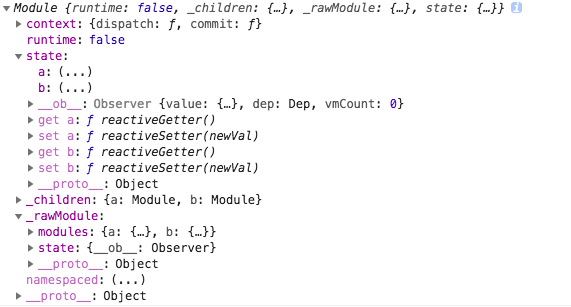

## Vuex

关于 [Vuex](https://vuex.vuejs.org/zh/) 的概念，官网已经讲得很清楚了。Vuex 主要用于解决组件间共享数据或状态的问题。小规模应用可以用 props、事件等父子组件通信方式，或者通过时间总线（event bus）来进行任意两个组件等通信。应用规模较大时候，这些方法会让数据流显得特别混乱。

Vuex 实现了一个单向数据流，在全局拥有一个 State 存放数据，所有修改 State 的操作必须通过 Mutation 进行，Mutation 的同时提供了订阅者模式供外部插件调用获取 State 数据的更新。所有异步接口需要走 Action ，常见于调用后端接口异步获取更新数据，而 Action 也是无法直接修改 State 的，还是需要通过 Mutation 来修改 State 的数据。最后，根据 State 的变化，渲染到视图上。Vuex 运行依赖 Vue 内部数据双向绑定机制，需要 new 一个 Vue 对象来实现“响应式化”，所以 Vuex 是一个专门为 Vue.js 设计的状态管理库。

### Vuex 安装

Vuex 其实是一个对象，使用 Vuex 之前需要调用 Vue.use(Vuex) ，调用 use 等时候，会调用 Vuex.install.apply(Vuex) 。

install 函数做两件事：

 - 确保 Vuex 只安装一次
 - 混入 beforeCreated 钩子函数（Vue 2.0 以上版本），可以在组件中使用 this.$store

```javascript
function install (_Vue) {
  //  确保 Vuex 只安装一次。Vuex 是一个单例
  if (Vue && _Vue === Vue) {
    if (process.env.NODE_ENV !== 'production') {
      console.error(
        '[vuex] already installed. Vue.use(Vuex) should be called only once.'
      );
    }
    return
  }
  Vue = _Vue;
  // 混入 beforeCreated 钩子函数
  applyMixin(Vue);
}
```

```javascript
var applyMixin = function (Vue) {
  var version = Number(Vue.version.split('.')[0]);

  if (version >= 2) {
    Vue.mixin({ beforeCreate: vuexInit });
  } else {
    // override init and inject vuex init procedure
    // for 1.x backwards compatibility.
    // ...
  }

  /**
   * Vuex init hook, injected into each instances init hooks list.
   */

  function vuexInit () {
    var options = this.$options;
    // store injection
    if (options.store) {
      this.$store = typeof options.store === 'function'
        ? options.store()
        : options.store;
    } else if (options.parent && options.parent.$store) {
      // 在根实例中注册 store 选项，该 store 实例会注入到根组件下单所有子组件
      // 即，在组件内可以通过 this.$store 访问状态树
      this.$store = options.parent.$store;
    }
  }
};

```

### Store 的初始化

创建一个 Store，并在根实例中注册该 store 。

```javascript
var store = new Vuex.Store({
	state,
	getters,
	mutations,
	actions
})

var app = new Vue({
	el: '#app',
	template: '<div><child></child></div>',
	store
}
```

这一步我们初始化 store

```javascript
Vuex.Store = function Store (options) {
  var this$1 = this;
  if ( options === void 0 ) options = {};

  // production env checks...

  // 获取 options 中的 state
  var state = options.state; if ( state === void 0 ) state = {};
  if (typeof state === 'function') {
    state = state() || {};
  }

  // store internal state
  this._committing = false;
  this._actions = Object.create(null);
  this._actionSubscribers = [];
  this._mutations = Object.create(null);
  this._wrappedGetters = Object.create(null);
  // modules 收集器
  this._modules = new ModuleCollection(options);
  this._modulesNamespaceMap = Object.create(null);
  this._subscribers = [];
  this._watcherVM = new Vue();

  // bind commit and dispatch to self
  var store = this;
  var ref = this;
  var dispatch = ref.dispatch;
  var commit = ref.commit;
  // 将 dispatch 与 commit 调用的 this 绑定为 store 对象本身，否则在组件内部 this.dispatch 时的 this 会指向组件的 vm
  this.dispatch = function boundDispatch (type, payload) {
    return dispatch.call(store, type, payload)
  };
  this.commit = function boundCommit (type, payload, options) {
    return commit.call(store, type, payload, options)
  };

  // strict mode
  this.strict = strict;

  // init root module.
  // this also recursively registers all sub-modules
  // and collects all module getters inside this._wrappedGetters
  installModule(this, state, [], this._modules.root);

  // initialize the store vm, which is responsible for the reactivity
  // (also registers _wrappedGetters as computed properties)
  resetStoreVM(this, state);

  // apply plugins
  plugins.forEach(function (plugin) { return plugin(this$1); });

  if (Vue.config.devtools) {
    devtoolPlugin(this);
  }
};
```

接下来看 this._modules 过程，以下面代码为例

```javascript
const moduleA = {
  state: { ... },
  mutations: { ... },
  actions: { ... },
  getters: { ... }
}
const moduleB = {
  state: { ... },
  mutations: { ... },
  actions: { ... }
}
const store = new Vuex.Store({
  state: { ... },
  modules: {
    a: moduleA,
    b: moduleB
  }
})
```

module 对象是对 store 分割出来的模块的描述。一个 module 对象：

```javascript
var Module = function Module (rawModule, runtime) {
  this.runtime = runtime;
  // 储存 children
  this._children = Object.create(null);
  // 储存原始的 rawModule
  this._rawModule = rawModule;
  var rawState = rawModule.state;
  // 储存 state
  this.state = (typeof rawState === 'function' ? rawState() : rawState) || {};
};
```

上面例子的 rootModule 长这样。可以看到 rootModule 的 state 对象内还有嵌套对象，它们是 rootModule 的子 module a 和 b 注入的 state ，可以通过 store.state.a 访问 a module 里面的 store 模块。



store 可以看成 root 。在第一次执行时，会初始化一个 rootModule，然后判断 root 中是否存在 modules 属性，然后递归注册 module 。对于 child 来说，会获取到他所属的 parent, 然后在 parent 中添加 module 。

```javascript
var ModuleCollection = function ModuleCollection (rawRootModule) {
  // register root module (Vuex.Store options)
  this.register([], rawRootModule, false);
};
```

根据 options 注册 rootModule 

```javascript
ModuleCollection.prototype.register = function register (path, rawModule, runtime) {
  var this$1 = this;
  if ( runtime === void 0 ) runtime = true;

  if (process.env.NODE_ENV !== 'production') {
    assertRawModule(path, rawModule);
  }

  var newModule = new Module(rawModule, runtime);
  // 第一次注册 root ，走 if 分支
  if (path.length === 0) {
    this.root = newModule;
  } else {
    var parent = this.get(path.slice(0, -1));
    parent.addChild(path[path.length - 1], newModule);
  }

  // register nested modules
  // 递归注册嵌套的 modules ，把子 module 的 key 压入 path，例如在处理 moduleA 时，path = ["a"]
  if (rawModule.modules) {
    forEachValue(rawModule.modules, function (rawChildModule, key) {
      this$1.register(path.concat(key), rawChildModule, runtime);
    });
  }
};
```

### installModule

installModule 主要是为 module 加上 [namespace 名称空间](https://vuex.vuejs.org/zh/guide/modules.html#%E5%91%BD%E5%90%8D%E7%A9%BA%E9%97%B4)（如果有），注册 mutation、action 以及 getter ，同时递归安装所有子 module 。

```javascript
// init root module.
// this also recursively registers all sub-modules
// and collects all module getters inside this._wrappedGetters
installModule(this, state, [], this._modules.root);
```

```javascript
function installModule (store, rootState, path, module, hot) {
  var isRoot = !path.length;

  // 获取 namespace，root 没有 namespace
  // 对于 modules: {a: moduleA} 来说
  // namespace = 'a/'
  var namespace = store._modules.getNamespace(path);

  // register in namespace map
  // 如果 module 标记了 namespaced: true ，在当前模块中缓存这个 module
  if (module.namespaced) {
    store._modulesNamespaceMap[namespace] = module;
  }

  // set state
  if (!isRoot && !hot) {
  	// 以下逻辑其实就是给 store.state 添加属性
  	// 在根实例 store 上，添加成这种形式：state { title: 'home', a: {...}, b: {...}}
  	// 并通过 Vue.set 将子 module 设为响应式的
    var parentState = getNestedState(rootState, path.slice(0, -1));
    var moduleName = path[path.length - 1];
    store._withCommit(function () {
      Vue.set(parentState, moduleName, module.state);
    });
  }

  // 重写 dispatch 和 commit
  // makeLocalContext 会将带命名空间的模块中的函数名称加上模块名称空间路径
  // 加入模块A有一个名为 add 的 mutation
  // 那么实际操作时候，commit 的第一个参数会被处理成 'a/add'，这样其他模块不会响应这个 mutation
  var local = module.context = makeLocalContext(store, namespace, path);


  // 依次注册子 module 的 mutation、action、getter
  // 带名称空间的 mudule 的 mutation 和 getter 里面的函数，会被打上该 module 的名称空间，类似上面的 'a/add'
  module.forEachMutation(function (mutation, key) {
    var namespacedType = namespace + key;
    registerMutation(store, namespacedType, mutation, local);
  });

  module.forEachAction(function (action, key) {
    var type = action.root ? key : namespace + key;
    var handler = action.handler || action;
    registerAction(store, type, handler, local);
  });

  module.forEachGetter(function (getter, key) {
    var namespacedType = namespace + key;
    registerGetter(store, namespacedType, getter, local);
  });

  // 递归安装 mudule
  module.forEachChild(function (child, key) {
    installModule(store, rootState, path.concat(key), child, hot);
  });
}
```

### resetStoreVM

这一步主要实现状态响应式，并且将 `_wrappedGetters` 作为 `computed` 属性。

```javascript
function resetStoreVM (store, state, hot) {
  var oldVm = store._vm;

  // bind store public getters
  store.getters = {};
  var wrappedGetters = store._wrappedGetters;
  var computed = {};
  // 遍历 _wrappedGetters 属性，给 computed 对象添加属性
  forEachValue(wrappedGetters, function (fn, key) {
    // use computed to leverage its lazy-caching mechanism
    computed[key] = function () { return fn(store); };
    Object.defineProperty(store.getters, key, {
      // 重写 get，访问 store.getter.xx 其实就是访问 store._vm[xx]，对应 computed 中的属性
      get: function () { return store._vm[key]; },
      enumerable: true // for local getters
    });
  });

  // use a Vue instance to store the state tree
  // suppress warnings just in case the user has added
  // some funky global mixins
  var silent = Vue.config.silent;
  Vue.config.silent = true;

  // 用 Vue 的实例来保存 state 树，把 getter 转换为 computed 属性
  // 访问 store.state，其实就是访问 store._vm.data.$$state
  store._vm = new Vue({
    data: {
      $$state: state
    },
    computed: computed
  });
  Vue.config.silent = silent;

  // enable strict mode for new vm
  if (store.strict) {
    enableStrictMode(store);
  }

  // 解除旧 vm 的 state 引用
  // hot reload 下强制 getter 重新计算
  if (oldVm) {
    if (hot) {
      // dispatch changes in all subscribed watchers
      // to force getter re-evaluation for hot reloading.
      store._withCommit(function () {
        oldVm._data.$$state = null;
      });
    }
    // 下个 tick 销毁旧 vm
    Vue.nextTick(function () { return oldVm.$destroy(); });
  }
}
```

### 常用 API

严格模式下，所有修改 state 的操作必须通过 mutation 实现。state 和 component 之间的数据流方向如下：

state --> getter（if required) --> component

component --> action(if required) -|$store.dispatch|-> mutation -|$store.commit|-> state

#### commit

commit 用于提交 mutation ，提交的风格有两种：带有 type 属性的对象，或者第一个参数为对应的 mutation 。

```javascript
store.commit({
  type: 'increment',
  amount: 10
})

store.commit('increment', {
	amount: 10
})
```

之所以能支持着两种写法，是因为 Store 的 commit 函数对参数做了处理。

```javascript
Store.prototype.commit = function commit (_type, _payload, _options) {
    var this$1 = this;

  // check object-style commit
  // 提取出 type、payload、options 信息
  var ref = unifyObjectStyle(_type, _payload, _options);
    var type = ref.type;
    var payload = ref.payload;
    var options = ref.options;

  var mutation = { type: type, payload: payload };
  // 取出 type 对应的 mutation 方法
  // 没有 namespace 的时候，会触发所有模块的 mutation
  var entry = this._mutations[type];
  if (!entry) {
    if (process.env.NODE_ENV !== 'production') {
      console.error(("[vuex] unknown mutation type: " + type));
    }
    return
  }
  this._withCommit(function () {
    entry.forEach(function commitIterator (handler) {
      // 在 registerMutation 时
      // var entry = store._mutations[type] || (store._mutations[type] = []);
      // entry.push(function wrappedMutationHandler (payload) {
      //   handler.call(store, local.state, payload); // 这里的 handler 指 type 对应的 mutation
      // });

      // 这里的 handler 就是上面的 wrappedMutationHandler ，是对 “执行 mutation ”这一动作的一层封装
      handler(payload);
    });
  });

  // 通知所有订阅者
  this._subscribers.forEach(function (sub) { return sub(mutation, this$1.state); });

  if (
    process.env.NODE_ENV !== 'production' &&
    options && options.silent
  ) {
    console.warn(
      "[vuex] mutation type: " + type + ". Silent option has been removed. " +
      'Use the filter functionality in the vue-devtools'
    );
  }
};
```

Store 给外部提供了一个订阅的方法，注册一个订阅函数，会 push 到 store._subscribers 中，返回值是取消这个订阅的函数。

```javascript
function genericSubscribe (fn, subs) {
  if (subs.indexOf(fn) < 0) {
    subs.push(fn);
  }
  return function () {
    var i = subs.indexOf(fn);
    if (i > -1) {
      subs.splice(i, 1);
    }
  }
}
```

在 commit 结束以后则会调用这些 _subscribers 中的订阅者，这个订阅者模式提供给外部一个监视 state 变化的可能。state 通过 mutation 改变时，可以有效捕获这些变化。例如使用 Vuex devTool 时，提交 mutation 会使 devtoolHook emit 一个事件。

#### dispatch

store.dispatch 分发 action ，类似 commit 的行为，actions 支持同样的载荷方式和对象方式进行分发。

```javascript
Store.prototype.dispatch = function dispatch (_type, _payload) {
  // 前面处理参数和获取 action 的过程和 commit 基本一样
  var this$1 = this;

  // check object-style dispatch
  var ref = unifyObjectStyle(_type, _payload);
  var type = ref.type;
  var payload = ref.payload;

  var action = { type: type, payload: payload };
  var entry = this._actions[type];
  if (!entry) {
    if (process.env.NODE_ENV !== 'production') {
      console.error(("[vuex] unknown action type: " + type));
    }
    return
  }
  // action 订阅函数，通过 Store.prototype.subscribeAction 收集订阅函数
  this._actionSubscribers.forEach(function (sub) { return sub(action, this$1.state); });


  // 类似 mutation ，这里的 action 也加了一层 wrappedActionHandler 封装
  // 并且 wrappedActionHandler 的返回类型会被转为 promise
  return entry.length > 1
    ? Promise.all(entry.map(function (handler) { return handler(payload); }))
    : entry[0](payload)
};
```

#### watch

watch 的处理主要是针对 getters 的。_watcherVM 是一个 Vue 的实例，所以 watch 就可以直接采用了 Vue 内部的 watch 特性提供了一种观察数据 getter 变动的方法。

```javascript
Store.prototype.watch = function watch (getter, cb, options) {
  var this$1 = this;

  if (process.env.NODE_ENV !== 'production') {
    assert(typeof getter === 'function', "store.watch only accepts a function.");
  }
  return this._watcherVM.$watch(function () { return getter(this$1.state, this$1.getters); }, cb, options)
};
```

#### 辅助函数 mapState mapGetters mapMutations MapActions

官网对 [mapState](https://vuex.vuejs.org/zh/guide/state.html#mapstate-%E8%BE%85%E5%8A%A9%E5%87%BD%E6%95%B0) 的描述：当一个组件需要获取多个状态时候，将这些状态都声明为计算属性会有些重复和冗余（不用计算属性，就要写多次 `this.$store.state.xxx` 不是很方便）。为了解决这个问题，我们可以使用 mapState 辅助函数帮助我们生成计算属性，让你少按几次键。

mapState 返回的是一个对象，可以把这整个对象赋给组件的 computed 属性，更好的做法是通过对象展开运算符 `...` 把对象混入组件已有的 computed 中。

```javascript
var mapState = normalizeNamespace(function (namespace, states) {
  var res = {};

  // normalizeMap([1, 2, 3]) => [ { key: 1, val: 1 }, { key: 2, val: 2 }, { key: 3, val: 3 } ]
  // normalizeMap({a: 1, b: 2, c: 3}) => [ { key: 'a', val: 1 }, { key: 'b', val: 2 }, { key: 'c', val: 3 } ]
  // states 对象可以是数组或对象
  normalizeMap(states).forEach(function (ref) {
    var key = ref.key;
    var val = ref.val;

    res[key] = function mappedState () {
      var state = this.$store.state;
      var getters = this.$store.getters;
      if (namespace) {
        var module = getModuleByNamespace(this.$store, 'mapState', namespace);
        if (!module) {
          return
        }
        state = module.context.state;
        getters = module.context.getters;
      }
      // 如果是 count: state => state.count ，函数会被执行，
      // 如果是 count: count ，处理成 state['count']
      return typeof val === 'function'
        ? val.call(this, state, getters)
        : state[val]
    };
    // mark vuex getter for devtools
    res[key].vuex = true;
  });
  return res
});
```

mapGetters 和 mapState 类型，它是把 getters 混入组件的 computed 属性中。mapMutations 和 mapActions 则是把 mutations / actions 混入组件的 methods 对象中。


> 参考
>
> [Vuex源码解析](https://github.com/answershuto/learnVue/blob/master/docs/Vuex%E6%BA%90%E7%A0%81%E8%A7%A3%E6%9E%90.MarkDown)